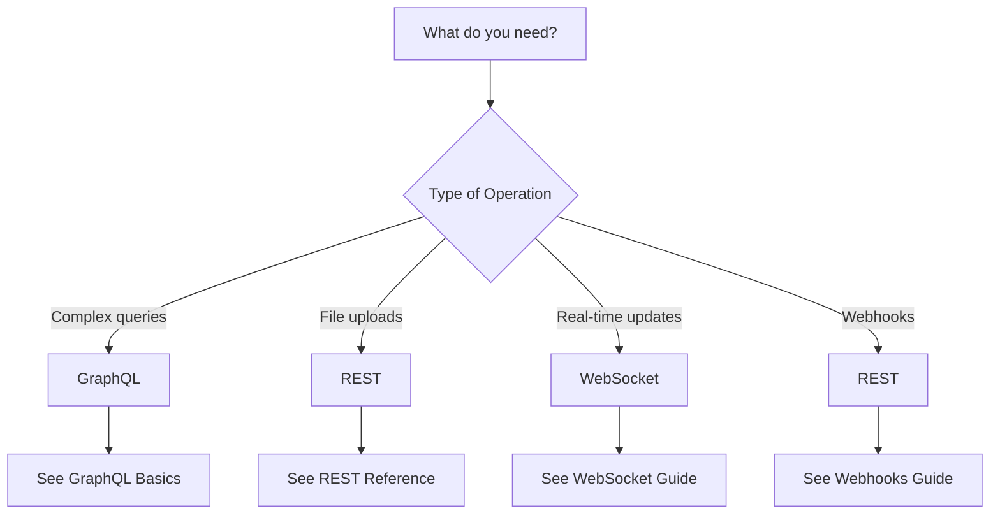

# API Documentation

## Overview

The hasteCRM provides multiple API interfaces optimized for different use cases:

| API Type | Best For | Protocol | Real-time |
|----------|----------|----------|-----------|
| **GraphQL** | Flexible queries, complex data fetching | HTTP/HTTPS | ✅ Subscriptions |
| **REST** | File uploads, webhooks, simple CRUD | HTTP/HTTPS | ❌ |
| **WebSocket** | Real-time updates, live collaboration | WS/WSS | ✅ Native |

## Quick Start

### Choose Your API



### Authentication

All APIs use the same authentication system. See [Authentication Guide](./auth-guide.md) for details.

- **JWT Tokens** for user sessions
- **API Keys** for server-to-server
- **OAuth 2.0** for third-party integrations

### Rate Limits

| API | Default Limit | Authenticated | Premium |
|-----|--------------|---------------|---------|
| GraphQL | 100/min | 1000/min | 5000/min |
| REST | 60/min | 600/min | 3000/min |
| WebSocket | 100 msg/min | 1000 msg/min | 5000 msg/min |

## API Documentation

### GraphQL API
- [GraphQL Basics](./graphql/basics.md) - Getting started with queries and mutations
- [GraphQL Advanced](./graphql/advanced.md) - Subscriptions, optimization, and patterns
- [GraphQL Reference](./graphql/reference.md) - Complete schema reference

### REST API  
- [REST Reference](./rest/reference.md) - Endpoint documentation
- [REST Examples](./rest/examples.md) - Code examples and SDKs
- [File Uploads](./rest/file-uploads.md) - Handling files and attachments

### Real-time APIs
- [WebSockets](./websockets.md) - Live updates and collaboration
- [Webhooks](./webhooks.md) - Event notifications

### Common Topics
- [Authentication Guide](./auth-guide.md) - Unified auth documentation
- [Error Handling](./errors.md) - Common error codes and handling
- [Pagination](./pagination.md) - Cursor and offset pagination
- [Rate Limiting](./rate-limiting.md) - Limits and best practices

## SDKs & Tools

### Official SDKs
```bash
# JavaScript/TypeScript
npm install @hastecrm/sdk

# Python
pip install hastecrm-sdk

# Go
go get github.com/hastecrm/sdk-go
```

### Development Tools
- [GraphQL Playground](http://localhost:4000/graphql) - Interactive GraphQL IDE
- [Postman Collection](./tools/postman-collection.json) - REST API collection
- [WebSocket Tester](./tools/websocket-test.html) - WebSocket debugging

## Best Practices

### 1. Use the Right API
- **GraphQL** for complex, nested data requirements
- **REST** for simple CRUD and file operations
- **WebSocket** for real-time features

### 2. Optimize Your Requests
- Request only needed fields in GraphQL
- Use pagination for large datasets
- Implement caching where appropriate

### 3. Handle Errors Gracefully
- Implement exponential backoff
- Check rate limit headers
- Log errors for debugging

## Getting Help

- 📚 [API Changelog](./CHANGELOG.md) - Latest updates
- 🐛 [Report Issues](https://github.com/hastecrm/api/issues)
- 💬 [Community Forum](https://forum.hastecrm.com/api)
- 📧 [Contact Support](mailto:api-support@hastecrm.com)