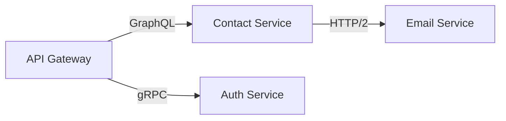
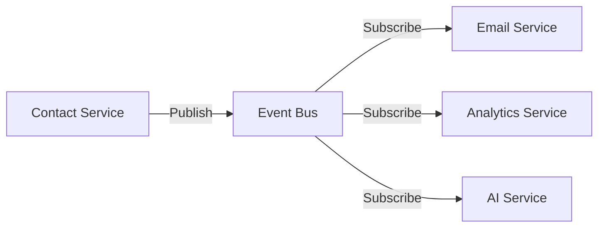
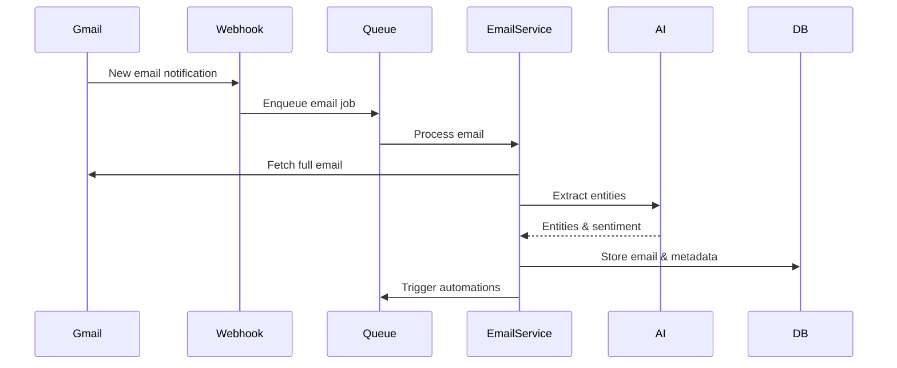
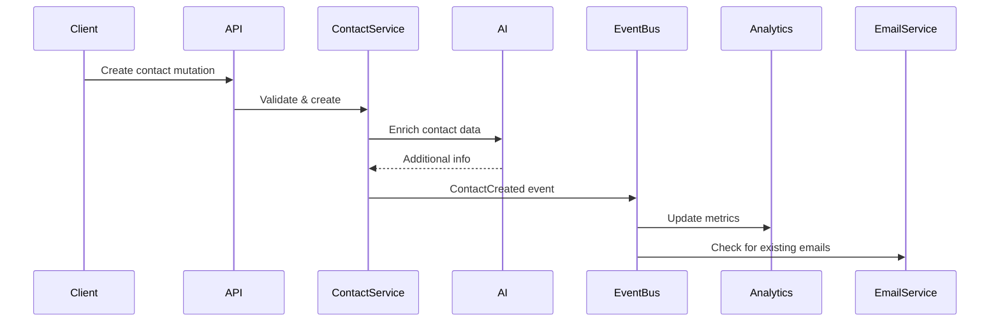

# Architecture Overview

## Table of Contents

1. [System Architecture](#system-architecture)
2. [Technology Decisions](#technology-decisions)
3. [Architecture Principles](#architecture-principles)
4. [Service Communication](#service-communication)
5. [Core Components](#core-components)
6. [Resilience Patterns](#resilience-patterns)
7. [Data Flow Examples](#data-flow-examples)
8. [Performance Targets](#performance-targets)
9. [Security Architecture](#security-architecture)
10. [Monitoring & Observability](#monitoring--observability)

## System Architecture

> **Note**: For authoritative version numbers and technology specifications, see [MASTER-CONFIG.md](../MASTER-CONFIG.md)

The hasteCRM is built using a modern, scalable microservices architecture with AI capabilities integrated at every layer.

### High-Level Architecture

```
┌─────────────────────────────────────────────────────────────────────┐
│                        Load Balancer (nginx)                        │
└───────────────────────┬─────────────────────┬──────────────────────┘
                       │                     │
                       ↓                     ↓
           ┌───────────────────────┐   ┌───────────────────┐
           │  Web App (3000)       │   │   API Gateway     │
           │  Next.js 14           │   │   (4000)          │
           │  - React 18           │   │   NestJS + GQL    │
           │  - Tailwind CSS       │   │                   │
           │  - Shadcn/ui          │   │                   │
           └───────────────────────┘   └─────────┬─────────┘
                                                 │
                                                 ↓
                                 ┌───────────────────────────┐
                                 │    Service Mesh       │
                                 │ (Internal Services)   │
                                 ├───────────────────────┤
                                 │ • Auth Service        │
                                 │ • Contact Service     │
                                 │ • Email Service       │
                                 │ • Pipeline Service    │
                                 │ • AI Orchestration    │
                                 │ • Analytics Service   │
                                 └───────────┬───────────┘
                                             │
                                             ↓
                    ┌────────────────────────┴─────────────────────┐
                    │                                             │
       ┌────────────┴──────┐    ┌────────────┴───────┐   ┌────────┴──────┐
       │   PostgreSQL      │    │      Redis         │   │ Message Queue │
       │   Primary DB      │    │  Cache/Sessions    │   │    BullMQ     │
       └───────────────────┘    └────────────────────┘   └───────────────┘
```

## Technology Decisions```

## Technology Decisions

### Why These Technologies?

| Component        | Technology | Version | Justification                                     |
| ---------------- | ---------- | ------- | ------------------------------------------------- |
| Frontend         | Next.js    | 14.x    | App Router for better performance, RSC support    |
| Backend          | NestJS     | 10.x    | Enterprise-grade structure, built-in DI           |
| Database         | PostgreSQL | 15+     | JSONB for flexibility, pgvector for AI embeddings |
| Cache            | Redis      | 7.2+    | Streams for event sourcing, JSON support          |
| Queue            | BullMQ     | 4.x     | Redis-based, better than RabbitMQ for our scale   |
| AI Orchestration | LangChain  | 0.1.x   | Unified interface for multiple LLMs               |
| Container        | Docker     | 24.x    | Industry standard, great ecosystem                |
| Orchestration    | Kubernetes | 1.28+   | Production-grade container orchestration          |
| Monitoring       | Prometheus | 2.x     | Time-series metrics, Kubernetes native            |

## Architecture Principles

### 1. AI-First Design

Every component is designed with AI integration in mind:

- Natural language interfaces for user interactions
- AI-powered data processing pipelines
- Intelligent caching and prediction systems

### 2. Event-Driven Architecture

```
User Action → API Gateway → Service → Event Bus → Subscribers
                                           ↓
                                           ├→ AI Processing
                                           ├→ Analytics
                                           └→ Notifications
```

### 3. Multi-Tenancy```

### 3. Multi-Tenancy

- Workspace-level isolation
- Row-level security (RLS) in PostgreSQL
- Separate Redis namespaces per workspace

### 4. Scalability Patterns

- Horizontal scaling for all services
- Read replicas for database
- Redis clustering for cache
- Queue-based async processing

## Service Communication

### Synchronous Communication



### Asynchronous Communication



### Communication Patterns:

- **Request-Response**: GraphQL for client queries
- **Event Sourcing**: All state changes emit events
- **CQRS**: Separate read/write models
- **Saga Pattern**: For distributed transactions

## Core Components

### Frontend (Next.js Application)

```typescript
// Key architectural decisions:
- App Router for better performance
- Server Components for initial load
- Client Components for interactivity
- Optimistic UI updates
- Real-time subscriptions via WebSocket
```

### API Gateway (NestJS + GraphQL)

```typescript
// Architecture patterns:
- GraphQL for flexible queries
- DataLoader for N+1 prevention
- JWT + refresh tokens
- Rate limiting per workspace
- Request context propagation
```

### Service Layer

Each service follows Domain-Driven Design:

```
Service/
    domain/          # Business logic
        entities/
        value-objects/
        services/
    application/     # Use cases
        commands/
        queries/
        events/
    infrastructure/  # External integrations
        repositories/
        external-apis/
        message-queue/
    presentation/    # GraphQL resolvers
```

### AI Integration Layer

```
         ┌─────────────────┐
         │   AI Gateway    │
         │  (Orchestrator) │
         └────────┬────────┘
                  │
     ┌────────────┼────────────┬────────────┐
     ↓            ↓            ↓            ↓
┌─────────┐  ┌─────────┐  ┌───────────┐  ┌───────┐
│ Claude  │  │  GPT-4  │  │Perplexity │  │ Local │
│   API   │  │   API   │  │    API    │  │  ML   │
└─────────┘  └─────────┘  └───────────┘  └───────┘
```

## Resilience Patterns```

## Resilience Patterns

### Circuit Breaker Implementation

```typescript
// AI Service calls with circuit breaker
@CircuitBreaker({
  failureThreshold: 5,
  timeout: 30000,
  resetTimeout: 60000
})
async callClaudeAPI(prompt: string) {
  // Implementation
}
```

### Retry Strategies

- **Exponential Backoff**: For transient failures
- **Dead Letter Queue**: For persistent failures
- **Fallback Responses**: Graceful degradation

### Health Checks

```yaml
/health/live    - Kubernetes liveness probe
/health/ready   - Kubernetes readiness probe
/health/startup - Initial startup verification
```

## Data Flow Examples

### Email Processing Flow



### Contact Creation Flow



## Performance Targets

### API Performance

| Endpoint Type     | Target (p95) | Current | SLO   |
| ----------------- | ------------ | ------- | ----- |
| GraphQL Query     | <100ms       | 85ms    | 99.9% |
| GraphQL Mutation  | <200ms       | 150ms   | 99.5% |
| File Upload       | <5s          | 3.2s    | 99%   |
| WebSocket Message | <50ms        | 35ms    | 99.9% |

### Throughput Targets

- Email Processing: 10,000/minute
- API Requests: 1,000 RPS
- WebSocket Connections: 50,000 concurrent
- Background Jobs: 100,000/hour

## Data Architecture

### Primary Database (PostgreSQL)

- **Version**: 15+
- **Extensions**: pgvector (for embeddings), uuid-ossp
- **Partitioning**: Time-based for activities and emails
- **Indexes**: Carefully optimized for common queries

### Caching Strategy (Redis)

```
Cache Layers:
1. Session Cache    - User sessions (TTL: 24h)
2. Query Cache      - GraphQL responses (TTL: 5m)
3. Computed Cache   - Analytics/aggregations (TTL: 1h)
4. AI Cache         - AI responses (TTL: 7d)
```

### Message Queue (BullMQ)

```
Queues:
- email-sync       - Gmail synchronization
- email-send       - Outbound email processing
- ai-processing    - AI task queue
- analytics        - Event processing
- webhooks         - External notifications
```

## Security Zones

### Network Architecture

```
┌─────────────────────────────────────────────────────────────────┐
│              DMZ (Public Zone)                      │
│  ┌─────────────┐         ┌─────────────┐          │
│  │     WAF     │         │      LB     │          │
│  └─────────────┘         └─────────────┘          │
└──────────────────────────┬──────────────────────────┘
                           │
                           ↓
┌──────────────────────────┴──────────────────────────┐
│          Application Zone (Private)                │
│  ┌─────────────┐         ┌─────────────┐          │
│  │     Web     │         │     API     │          │
│  └─────────────┘         └─────────────┘          │
└──────────────────────────┬──────────────────────────┘
                           │
                           ↓
┌──────────────────────────┴──────────────────────────┐
│           Data Zone (Restricted)                   │
│  ┌─────────────┐         ┌─────────────┐          │
│  │      DB     │         │    Redis    │          │
│  └─────────────┘         └─────────────┘          │
└─────────────────────────────────────────────────────┘
```

### Authentication & Authorization```

### Authentication & Authorization

```
Request Flow:
1. Client → JWT Token
2. API Gateway → Verify JWT
3. Service → Check Permissions
4. Database → Row-Level Security
```

### Data Encryption

- **At Rest**: AES-256 for sensitive data
- **In Transit**: TLS 1.3 minimum
- **Secrets**: Vault for API keys
- **PII**: Separate encrypted columns

## Cost Optimization

### Resource Allocation

```yaml
Service CPU/Memory Allocation:
  - API Gateway: 2 CPU, 4GB RAM
  - Services: 1 CPU, 2GB RAM
  - AI Workers: 4 CPU, 8GB RAM
  - Cache: 4 CPU, 16GB RAM
```

### Cost Reduction Strategies

1. **AI API Optimization**

   - Cache common responses
   - Use cheaper models for simple tasks
   - Batch requests when possible

2. **Database Optimization**

   - Automatic partitioning for old data
   - Archive to cold storage after 1 year
   - Read replicas only for analytics

3. **Infrastructure**
   - Spot instances for workers
   - Auto-scaling based on load
   - Reserved instances for baseline

## Real-time Architecture

### WebSocket Strategy

```
Client ↔ WebSocket ↔ API Gateway
                           ↓
                    Redis Pub/Sub
                           ↓
                     ┌─────┴─────┐
                     ↓           ↓
                 Services    Background Jobs
```

### Event Types

- Contact updates
- Email arrival
- Pipeline changes
- AI task completion
- Analytics updates

## Deployment Architecture

### Container Strategy

```
Each service runs in its own container:
- web:latest       - Frontend application
- api:latest       - API Gateway
- auth:latest      - Auth service
- email:latest     - Email service
- ai:latest        - AI orchestration
- worker:latest    - Background workers
```

### Kubernetes Deployment

```yaml
Namespace: haste-crm
  Deployments
  web-deployment
  api-deployment
  service-deployments
  Services
  web-service
  api-service
  internal-services
  ConfigMaps
  app-config
  Secrets
  api-keys
```

## Disaster Recovery

### Backup Strategy

- **Database**: Continuous replication + daily snapshots
- **File Storage**: Cross-region replication
- **Configuration**: Git-based with encrypted secrets

### RTO/RPO Targets

- **RTO** (Recovery Time Objective): 1 hour
- **RPO** (Recovery Point Objective): 5 minutes

### Failover Procedures

1. Automatic health check failure detection
2. DNS failover to standby region (5 min)
3. Database promotion if needed (10 min)
4. Cache warming (15 min)
5. Full service restoration (< 1 hour)

## Monitoring & Alerting

### Three Pillars

1. **Logs**: Structured JSON logging → ELK Stack
2. **Metrics**: Prometheus + Grafana dashboards
3. **Traces**: OpenTelemetry → Jaeger

### Critical Alerts

| Metric            | Threshold    | Action             |
| ----------------- | ------------ | ------------------ |
| API Error Rate    | >1%          | Page on-call       |
| Response Time     | >500ms (p95) | Investigate        |
| AI API Failures   | >5 in 5min   | Failover to backup |
| Email Queue Depth | >10,000      | Scale workers      |
| Database CPU      | >80%         | Scale up           |

### Dashboards

1. **Executive Dashboard**: KPIs, revenue impact
2. **Operations Dashboard**: System health
3. **AI Usage Dashboard**: Costs and performance
4. **User Experience**: Page load, errors

## Development Environment

### Local Development Stack

```yaml
version: "3.8"
services:
  # Development database with sample data
  postgres:
    image: postgres:15-alpine
    volumes:
      - ./init.sql:/docker-entrypoint-initdb.d/
    ports:
      - "5432:5432"

  # Redis with persistence disabled
  redis:
    image: redis:7-alpine
    command: redis-server --save ""
    ports:
      - "6379:6379"

  # Local S3 (MinIO)
  minio:
    image: minio/minio
    command: server /data --console-address ":9001"
    ports:
      - "9000:9000"
      - "9001:9001"

  # Email testing (MailHog)
  mailhog:
    image: mailhog/mailhog
    ports:
      - "1025:1025"
      - "8025:8025"
```

### Development Workflow

```
1. Git Push → GitHub
2. GitHub Actions → Run Tests
3. Build Docker Images
4. Push to Registry
5. Deploy to Staging
6. Run E2E Tests
7. Deploy to Production
```

## Frontend Architecture

### Component Structure

```
components/
    ui/              # Shadcn/ui components
    features/        # Feature-specific components
        contacts/
        emails/
        pipelines/
    layouts/         # Page layouts
    providers/       # Context providers
```

### State Management

```typescript
// Using Zustand for client state
// Server state via React Query + GraphQL

Client State:
- UI State (modals, sidebars)
- User preferences
- Optimistic updates

Server State:
- All business data
- Cached via React Query
- Real-time via subscriptions
```

## Integration Points

### External Services

1. **Google Workspace**

   - OAuth 2.0 for authentication
   - Gmail API for email sync
   - Google Drive for attachments
   - Calendar API for meetings

2. **AI Services**

   - Claude API for complex reasoning
   - GPT-4 for content generation
   - Perplexity for web research
   - LangChain for orchestration

3. **Email Infrastructure**
   - SendGrid for transactional
   - Custom SMTP for campaigns
   - Email tracking pixel server
   - Webhook receivers

## Scaling Considerations

### Horizontal Scaling

- Stateless services
- Load balancer distribution
- Database read replicas
- Redis cluster mode

### Performance Optimizations

- GraphQL query complexity limits
- Database connection pooling
- Aggressive caching strategy
- CDN for static assets
- Image optimization pipeline

## Future Architecture

### Planned Enhancements

1. **Edge Computing**: Deploy workers closer to users
2. **ML Pipeline**: Custom model training infrastructure
3. **Data Lake**: Historical data analysis
4. **Multi-Region**: Geographic distribution
5. **Federated GraphQL**: Microservices independence

## API Versioning Strategy

### Version Management

We follow a URI-based versioning approach with backward compatibility guarantees:

```typescript
// API Version Format
/api/v1/contacts    // Current stable version
/api/v2/contacts    // Next version (beta)
/api/latest/...     // Latest (unstable)

// GraphQL versioning via schema evolution
type Contact @deprecated(reason: "Use ContactV2") {
  id: ID!
  name: String!
}

type ContactV2 {
  id: ID!
  firstName: String!
  lastName: String!
  fullName: String!
}
```

### Deprecation Policy

- 6-month deprecation notice
- Automatic migration tools provided
- Usage analytics before removal
- Clear upgrade documentation

## Development Best Practices

### Code Organization

```
src/
├── modules/           # Feature modules
│   ├── contacts/
│   │   ├── domain/    # Business logic
│   │   ├── api/       # Controllers/Resolvers
│   │   ├── infra/     # Database/External
│   │   └── tests/     # Unit/Integration tests
│   └── shared/        # Shared utilities
├── common/            # Cross-cutting concerns
└── config/            # Configuration
```

### Testing Strategy

1. **Unit Tests**: 80% coverage minimum
2. **Integration Tests**: Critical paths
3. **E2E Tests**: User journeys
4. **Load Tests**: Performance validation
5. **Contract Tests**: API compatibility

### Code Quality Standards

- ESLint + Prettier for consistency
- Pre-commit hooks for validation
- Required PR reviews (2 approvers)
- Automated security scanning
- Performance budgets enforcement

### CI/CD Pipeline

```yaml
Pipeline Stages:
1. Lint & Format Check
2. Unit Tests (parallel)
3. Build & Type Check
4. Integration Tests
5. Security Scan
6. Docker Build
7. Deploy to Staging
8. E2E Tests
9. Deploy to Production
```

## Enhanced Monitoring & Observability

> **Note**: See [MASTER-CONFIG.md](../MASTER-CONFIG.md#monitoring-stack) for the authoritative monitoring stack configuration.

### Production Observability Stack

```
┌─────────────────────────────────────────────────────┐
│                  Datadog Platform                    │
│  ┌───────────┐  ┌───────────┐  ┌─────────────────┐ │
│  │  Metrics  │  │   Logs    │  │   APM Traces    │ │
│  └─────┬─────┘  └─────┬─────┘  └────────┬────────┘ │
└────────┼──────────────┼─────────────────┼──────────┘
         │              │                  │
      StatsD        DD Agent          DD APM
         │              │                  │
    ┌────┴────┐    ┌────┴────┐      ┌─────┴─────┐
    │App Metrics   │Log Files │      │Trace Agent│
    └─────────┘    └─────────┘      └───────────┘
                        +
                   Sentry (Errors)
```

### Key Metrics

```typescript
// Business Metrics
- Monthly Active Users (MAU)
- Email Send Success Rate
- AI Feature Adoption
- Pipeline Conversion Rate
- Customer Health Score

// Technical Metrics
- API Latency (p50, p95, p99)
- Error Rate by Service
- Database Query Performance
- Cache Hit Rate
- Queue Processing Time

// Infrastructure Metrics
- CPU/Memory Utilization
- Disk I/O Performance
- Network Throughput
- Container Restart Rate
- Auto-scaling Events
```

### Alerting Rules

```yaml
# Critical Alerts (PagerDuty)
- name: API_HIGH_ERROR_RATE
  expr: rate(http_requests_total{status=~"5.."}[5m]) > 0.05
  severity: critical

- name: DATABASE_CONNECTION_POOL_EXHAUSTED
  expr: pg_connection_pool_available == 0
  severity: critical

# Warning Alerts (Slack)
- name: HIGH_MEMORY_USAGE
  expr: container_memory_usage_bytes / container_spec_memory_limit_bytes > 0.85
  severity: warning
```

### Distributed Tracing

```typescript
// Trace Context Propagation
interface TraceContext {
  traceId: string;
  spanId: string;
  flags: number;
  baggage: Record<string, string>;
}

// Automatic instrumentation
@Trace()
async processEmail(emailId: string): Promise<void> {
  const span = tracer.startSpan('email.process');
  try {
    // Processing logic
  } finally {
    span.end();
  }
}
```

### Log Aggregation

```json
{
  "timestamp": "2024-01-10T10:30:45.123Z",
  "level": "info",
  "service": "email-service",
  "traceId": "abc123",
  "userId": "user-456",
  "message": "Email processed successfully",
  "metadata": {
    "emailId": "email-789",
    "processingTime": 245,
    "recipient": "user@haste.nyc"
  }
}
```

## Performance Optimization Strategies

### Database Optimization

- Connection pooling with pgBouncer
- Prepared statements caching
- Materialized views for analytics
- Partitioning for time-series data
- Query optimization with EXPLAIN ANALYZE

### Caching Strategy

```typescript
// Multi-layer caching
1. Browser Cache (static assets)
2. CDN Cache (Cloudflare)
3. Application Cache (Redis)
4. Database Cache (query results)

// Cache invalidation patterns
- TTL-based expiration
- Event-driven invalidation
- Cache-aside pattern
- Write-through for critical data
```

### API Performance

- GraphQL query complexity analysis
- DataLoader for N+1 prevention
- Field-level caching
- Persisted queries
- Response compression

## Further Reading

- [Database Schema Design](database-schema.md)
- [API Design Principles](api-design.md)
- [Security Best Practices](security.md)
- [Deployment Guide](../deployment/kubernetes.md)
- [Performance Tuning Guide](../deployment/performance.md)
- [Disaster Recovery Plan](../deployment/disaster-recovery.md)
