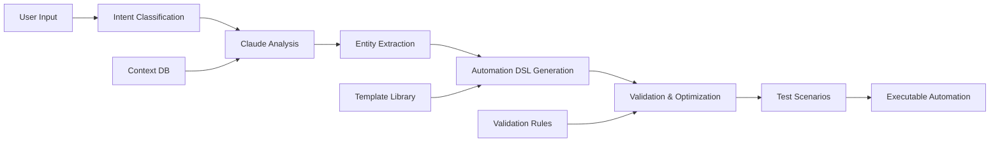

# AI Integration Features

> **Note**: This is a comprehensive document. For specific implementations, see:
> - [AI Provider Setup Guide](../guides/ai-provider-setup.md)
> - [AI API Reference](../api/ai-endpoints.md)
> - [AI Best Practices](../guides/ai-best-practices.md)

## Quick Navigation

**Getting Started**: [Overview](#1-overview) → [Provider Setup](#2-ai-providers) → [Basic Implementation](#3-core-ai-features)

**Advanced Topics**: [Architecture](#4-ai-integration-architecture) → [Monitoring](#5-ai-usage-monitoring--analytics) → [Safety](#6-ai-safety--compliance)

## Table of Contents

1. [Overview](#1-overview)
2. [AI Providers](#2-ai-providers)
   - 2.1 [Integrated AI Services](#21-integrated-ai-services)
   - 2.2 [Provider Selection Logic](#22-provider-selection-logic)
3. [Core AI Features](#3-core-ai-features)
   - 3.1 [Natural Language Automation Builder](#31-natural-language-automation-builder)
   - 3.2 [AI-Powered Email Composition](#32-ai-powered-email-composition)
   - 3.3 [Meeting Intelligence](#33-meeting-intelligence)
   - 3.4 [Contact Enrichment & Intelligence](#34-contact-enrichment--intelligence)
   - 3.5 [Predictive Analytics](#35-predictive-analytics)
4. [AI Integration Architecture](#4-ai-integration-architecture)
   - 4.1 [Enhanced AI Service Layer](#41-enhanced-ai-service-layer)
   - 4.2 [Advanced Prompt Engineering](#42-advanced-prompt-engineering)
5. [AI Usage Monitoring & Analytics](#5-ai-usage-monitoring--analytics)
   - 5.1 [Comprehensive Monitoring System](#51-comprehensive-monitoring-system)
6. [AI Safety & Compliance](#6-ai-safety--compliance)
   - 6.1 [Enhanced Safety Framework](#61-enhanced-safety-framework)
7. [Advanced AI Features](#7-advanced-ai-features)
   - 7.1 [AI-Powered Workflow Automation](#71-ai-powered-workflow-automation)
   - 7.2 [Conversational AI Assistant](#72-conversational-ai-assistant)
8. [Enterprise AI Features](#8-enterprise-ai-features)
   - 8.1 [Multi-tenant AI Isolation](#81-multi-tenant-ai-isolation)
9. [Best Practices](#9-best-practices)
   - 9.1 [Effective Prompt Engineering](#91-effective-prompt-engineering)
   - 9.2 [Cost Optimization Strategies](#92-cost-optimization-strategies)
   - 9.3 [Error Handling & Resilience](#93-error-handling--resilience)
10. [Training & Fine-tuning](#10-training--fine-tuning)
    - 10.1 [Custom Model Training Pipeline](#101-custom-model-training-pipeline)
11. [Integration Examples](#11-integration-examples)
    - 11.1 [Slack Integration](#111-slack-integration)
    - 11.2 [Zapier Integration](#112-zapier-integration)
    - 11.3 [Microsoft Teams Integration](#113-microsoft-teams-integration)
12. [Performance Optimization](#12-performance-optimization)
    - 12.1 [AI Response Optimization](#121-ai-response-optimization)
13. [AI Ethics & Governance](#13-ai-ethics--governance)
    - 13.1 [Ethical AI Framework](#131-ethical-ai-framework)
14. [Future Roadmap](#14-future-roadmap)
    - 14.1 [Upcoming AI Capabilities](#141-upcoming-ai-capabilities)
        - 14.1.1 [Autonomous AI Agents](#1411-autonomous-ai-agents)
        - 14.1.2 [Predictive Customer Success](#1412-predictive-customer-success)
        - 14.1.3 [AI-Powered Revenue Operations](#1413-ai-powered-revenue-operations)
        - 14.1.4 [Multimodal AI Integration](#1414-multimodal-ai-integration)
        - 14.1.5 [Advanced Personalization](#1415-advanced-personalization)
15. [Resources & Support](#15-resources--support)
    - 15.1 [Documentation](#151-documentation)
    - 15.2 [Tools](#152-tools)
    - 15.3 [Support](#153-support)
    - 15.4 [Training](#154-training)

---

## 1. Overview

hasteCRM leverages multiple AI providers to deliver intelligent automation, content generation, and insights. This document covers the AI capabilities, integration patterns, and best practices for using AI features effectively.

## 2. AI Providers

### 2.1 Integrated AI Services

| Provider | Primary Use Cases | Models | Rate Limits | Cost |
|----------|------------------|--------|-------------|------|
| **Claude (Anthropic)** | Complex reasoning, automation creation, long-form content, analysis | claude-3-opus<br>claude-3-sonnet<br>claude-3-haiku | 100 req/min<br>500 req/min<br>1000 req/min | $15/$3/$0.25 per 1M tokens |
| **GPT-4 (OpenAI)** | Email generation, quick responses, translations, chat | gpt-4-turbo<br>gpt-4<br>gpt-3.5-turbo | 500 req/min<br>200 req/min<br>3000 req/min | $10/$30/$0.50 per 1M tokens |
| **Perplexity** | Web research, company enrichment, market intelligence | pplx-70b-online<br>pplx-7b-online | 50 req/min<br>100 req/min | $1/$0.25 per 1K requests |
| **Local ML** | Lead scoring, classification, predictions, embeddings | Custom models | Unlimited | Infrastructure cost only |

### 2.2 Provider Selection Logic
```typescript
// Intelligent provider selection with fallback
class AIProviderSelector {
  private readonly providerMatrix = {
    // Task type -> [primary, ...fallbacks]
    COMPLEX_REASONING: ['CLAUDE_OPUS', 'GPT4', 'CLAUDE_SONNET'],
    AUTOMATION_CREATION: ['CLAUDE_OPUS', 'CLAUDE_SONNET'],
    EMAIL_GENERATION: ['GPT4_TURBO', 'CLAUDE_HAIKU', 'GPT35_TURBO'],
    QUICK_SUMMARY: ['CLAUDE_HAIKU', 'GPT35_TURBO'],
    WEB_RESEARCH: ['PERPLEXITY_70B', 'PERPLEXITY_7B'],
    COMPANY_INFO: ['PERPLEXITY_70B', 'PERPLEXITY_7B'],
    LEAD_SCORING: ['LOCAL_ML'],
    CLASSIFICATION: ['LOCAL_ML', 'GPT35_TURBO'],
    EMBEDDINGS: ['LOCAL_ML', 'OPENAI_EMBEDDING'],
  };

  async selectProvider(
    task: AITask,
    context: SelectionContext
  ): Promise<AIProvider> {
    const providers = this.providerMatrix[task.type];
    
    for (const provider of providers) {
      // Check availability
      if (await this.isAvailable(provider, context)) {
        // Check rate limits
        if (await this.checkRateLimit(provider, context)) {
          // Check cost budget
          if (await this.checkBudget(provider, task, context)) {
            return provider;
          }
        }
      }
    }
    
    throw new NoAvailableProviderError(task);
  }

  private async isAvailable(provider: string, context: SelectionContext): Promise<boolean> {
    const health = await this.healthCheck(provider);
    return health.status === 'healthy' && 
           health.latency < context.maxLatency;
  }
}
```

[Back to top](#table-of-contents)

---

## 3. Core AI Features

### 3.1 Natural Language Automation Builder

Create complex automations using plain English descriptions with intelligent understanding of context and intent.

#### Architecture


#### Enhanced Implementation
```typescript
interface AutomationBuilderConfig {
  maxComplexity: number;
  allowedTriggers: TriggerType[];
  allowedActions: ActionType[];
  safeguards: SafeguardRule[];
  testScenarios: number;
}

class NaturalLanguageAutomationBuilder {
  constructor(
    private ai: AIService,
    private validator: AutomationValidator,
    private config: AutomationBuilderConfig
  ) {}

  async createAutomation(input: string, context: Context): Promise<Automation> {
    // 1. Classify intent and extract requirements
    const intent = await this.classifyIntent(input);
    const requirements = await this.extractRequirements(input, intent);
    
    // 2. Generate automation using Claude
    const automationDraft = await this.ai.generate({
      model: 'claude-3-opus',
      prompt: this.buildPrompt(requirements, context),
      temperature: 0.3, // Lower temperature for more consistent output
    });
    
    // 3. Validate and optimize
    const validated = await this.validator.validate(automationDraft);
    const optimized = await this.optimize(validated);
    
    // 4. Generate test scenarios
    const tests = await this.generateTests(optimized);
    
    // 5. Simulate execution
    const simulation = await this.simulate(optimized, tests);
    
    return {
      automation: optimized,
      tests,
      simulation,
      confidence: this.calculateConfidence(simulation),
    };
  }

  private buildPrompt(requirements: Requirements, context: Context): string {
    return `
      Create an automation based on these requirements:
      ${JSON.stringify(requirements, null, 2)}
      
      Context:
      - Workspace: ${context.workspace.name}
      - Available integrations: ${context.integrations.join(', ')}
      - User expertise level: ${context.user.expertiseLevel}
      
      Constraints:
      - Use only available triggers: ${this.config.allowedTriggers.join(', ')}
      - Use only available actions: ${this.config.allowedActions.join(', ')}
      - Ensure idempotency for all actions
      - Include error handling
      - Optimize for performance
      
      Output format: Automation DSL JSON
      
      Examples:
      ${this.getRelevantExamples(requirements)}
    `;
  }

  private async generateTests(automation: Automation): Promise<TestScenario[]> {
    const scenarios = [];
    
    // Generate positive test cases
    scenarios.push(...await this.generatePositiveTests(automation));
    
    // Generate negative test cases
    scenarios.push(...await this.generateNegativeTests(automation));
    
    // Generate edge cases
    scenarios.push(...await this.generateEdgeCases(automation));
    
    return scenarios;
  }
}

// Example usage with enhanced error handling
async function createAutomationWithRetry(prompt: string) {
  const builder = new NaturalLanguageAutomationBuilder(ai, validator, config);
  
  try {
    const result = await builder.createAutomation(prompt, context);
    
    if (result.confidence < 0.8) {
      // Ask for clarification
      const clarification = await askUserForClarification(result);
      return await builder.createAutomation(clarification, context);
    }
    
    return result;
  } catch (error) {
    if (error instanceof ComplexityError) {
      // Break down into smaller automations
      const subAutomations = await builder.decompose(prompt);
      return await Promise.all(
        subAutomations.map(sub => builder.createAutomation(sub, context))
      );
    }
    throw error;
  }
}
```

### 3.2 AI-Powered Email Composition

#### Advanced Email Generation Pipeline
```typescript
interface EmailGenerationConfig {
  provider: AIProvider;
  style: EmailStyle;
  personalization: PersonalizationLevel;
  compliance: ComplianceRules;
  optimization: OptimizationSettings;
}

class AIEmailComposer {
  private readonly styleGuides = new Map<EmailStyle, StyleGuide>();
  private readonly complianceChecker = new ComplianceChecker();
  
  async composeEmail(
    request: EmailRequest,
    config: EmailGenerationConfig
  ): Promise<ComposedEmail> {
    // 1. Gather comprehensive context
    const context = await this.gatherContext(request);
    
    // 2. Analyze recipient preferences
    const preferences = await this.analyzeRecipientPreferences(request.recipient);
    
    // 3. Generate multiple variants
    const variants = await this.generateVariants(request, context, config);
    
    // 4. Score and select best variant
    const selected = await this.selectBestVariant(variants, preferences);
    
    // 5. Optimize for deliverability
    const optimized = await this.optimizeDeliverability(selected);
    
    // 6. Ensure compliance
    const compliant = await this.ensureCompliance(optimized, config.compliance);
    
    // 7. Add smart personalization
    const personalized = await this.personalizeContent(compliant, context);
    
    // 8. Generate subject line variants
    const subjectLines = await this.generateSubjectLines(personalized);
    
    return {
      email: personalized,
      subjectLines,
      metadata: {
        readingTime: this.calculateReadingTime(personalized),
        sentiment: await this.analyzeSentiment(personalized),
        spamScore: await this.checkSpamScore(personalized),
        personalizationScore: this.calculatePersonalizationScore(personalized),
      },
      alternatives: variants,
    };
  }

  private async gatherContext(request: EmailRequest): Promise<EmailContext> {
    const [
      contactHistory,
      companyInfo,
      recentInteractions,
      dealStatus,
      contentPreferences,
    ] = await Promise.all([
      this.getContactHistory(request.recipient),
      this.enrichCompanyData(request.recipient.company),
      this.getRecentInteractions(request.recipient.id),
      this.getDealStatus(request.recipient.id),
      this.getContentPreferences(request.recipient.id),
    ]);

    return {
      contact: request.recipient,
      history: contactHistory,
      company: companyInfo,
      interactions: recentInteractions,
      deals: dealStatus,
      preferences: contentPreferences,
      sender: request.sender,
      campaign: request.campaign,
    };
  }

  private async generateVariants(
    request: EmailRequest,
    context: EmailContext,
    config: EmailGenerationConfig
  ): Promise<EmailVariant[]> {
    const prompts = this.buildVariantPrompts(request, context, config);
    
    const variants = await Promise.all(
      prompts.map(async (prompt, index) => {
        const content = await this.ai.generate({
          model: config.provider,
          prompt,
          temperature: 0.7 + (index * 0.1), // Vary temperature for diversity
          maxTokens: 500,
        });
        
        return {
          content,
          style: prompt.style,
          tone: prompt.tone,
          score: 0, // Will be calculated
        };
      })
    );
    
    return variants;
  }

  private async optimizeDeliverability(email: Email): Promise<Email> {
    // Check and fix common deliverability issues
    const optimizations = [
      this.optimizeSubjectLine,
      this.balanceTextToHtml,
      this.checkSpamTriggers,
      this.optimizeImages,
      this.validateLinks,
      this.ensureMobileResponsive,
    ];
    
    let optimized = email;
    for (const optimization of optimizations) {
      optimized = await optimization.call(this, optimized);
    }
    
    return optimized;
  }
}

// Advanced email templates with AI enhancement
class AIEmailTemplates {
  private templates = new Map<string, EmailTemplate>();
  
  async getTemplate(type: EmailType, context: Context): Promise<EmailTemplate> {
    const baseTemplate = this.templates.get(type);
    
    if (!baseTemplate) {
      // Generate template on the fly
      return await this.generateTemplate(type, context);
    }
    
    // Enhance template with AI
    return await this.enhanceTemplate(baseTemplate, context);
  }
  
  private async enhanceTemplate(
    template: EmailTemplate,
    context: Context
  ): Promise<EmailTemplate> {
    const enhanced = { ...template };
    
    // Dynamic sections based on context
    enhanced.sections = await Promise.all(
      template.sections.map(async section => {
        if (section.aiEnhanced) {
          return await this.enhanceSection(section, context);
        }
        return section;
      })
    );
    
    // Industry-specific adjustments
    if (context.recipient.industry) {
      enhanced.tone = await this.adjustToneForIndustry(
        template.tone,
        context.recipient.industry
      );
    }
    
    // Timing-based adjustments
    enhanced.urgency = this.calculateUrgency(context);
    
    return enhanced;
  }
}
```

### 3.3 Meeting Intelligence

#### Enhanced Meeting Processing Pipeline
```typescript
interface MeetingIntelligenceConfig {
  transcriptionProvider: 'whisper' | 'google' | 'aws';
  analysisDepth: 'basic' | 'detailed' | 'comprehensive';
  realTimeProcessing: boolean;
  autoActions: boolean;
}

class MeetingIntelligenceProcessor {
  private readonly transcriber: TranscriptionService;
  private readonly analyzer: MeetingAnalyzer;
  private readonly actionExtractor: ActionItemExtractor;
  
  async processMeeting(
    meeting: Meeting,
    config: MeetingIntelligenceConfig
  ): Promise<MeetingIntelligence> {
    // 1. Real-time or batch processing
    if (config.realTimeProcessing) {
      return await this.processRealTime(meeting, config);
    }
    
    // 2. Transcribe with speaker diarization
    const transcript = await this.transcriber.transcribe(meeting.recording, {
      provider: config.transcriptionProvider,
      speakerDiarization: true,
      punctuation: true,
      timestamps: true,
    });
    
    // 3. Analyze meeting dynamics
    const analysis = await this.analyzer.analyze(transcript, {
      depth: config.analysisDepth,
      includeEmotionalTone: true,
      identifyKeyMoments: true,
    });
    
    // 4. Extract and categorize insights
    const insights = await this.extractInsights(transcript, analysis);
    
    // 5. Generate actionable intelligence
    const intelligence = await this.generateIntelligence(insights, meeting.context);
    
    // 6. Auto-execute actions if enabled
    if (config.autoActions) {
      await this.executeAutoActions(intelligence);
    }
    
    return intelligence;
  }
  
  private async extractInsights(
    transcript: Transcript,
    analysis: MeetingAnalysis
  ): Promise<MeetingInsights> {
    const [
      summary,
      keyPoints,
      decisions,
      actionItems,
      risks,
      opportunities,
      sentiment,
      nextSteps,
    ] = await Promise.all([
      this.generateSummary(transcript, analysis),
      this.extractKeyPoints(transcript, analysis),
      this.extractDecisions(transcript),
      this.extractActionItems(transcript),
      this.identifyRisks(transcript, analysis),
      this.identifyOpportunities(transcript, analysis),
      this.analyzeSentiment(transcript, analysis),
      this.suggestNextSteps(transcript, analysis),
    ]);
    
    return {
      summary,
      keyPoints,
      decisions,
      actionItems: this.prioritizeActionItems(actionItems),
      risks: this.assessRisks(risks),
      opportunities: this.scoreOpportunities(opportunities),
      sentiment,
      nextSteps,
      keyMoments: this.identifyKeyMoments(transcript, analysis),
    };
  }
  
  private async generateIntelligence(
    insights: MeetingInsights,
    context: MeetingContext
  ): Promise<MeetingIntelligence> {
    // Use Claude for comprehensive analysis
    const intelligence = await this.ai.analyze({
      model: 'claude-3-opus',
      data: insights,
      context,
      prompt: `
        Analyze this meeting and provide:
        1. Strategic implications
        2. Relationship dynamics
        3. Deal probability changes
        4. Recommended follow-up strategy
        5. Red flags or concerns
        6. Competitive intelligence mentioned
        7. Budget or timeline indicators
      `,
    });
    
    return {
      ...insights,
      strategic: intelligence.strategic,
      relational: intelligence.relational,
      commercial: intelligence.commercial,
      competitive: intelligence.competitive,
      recommendations: this.prioritizeRecommendations(intelligence.recommendations),
    };
  }
}

// Real-time meeting assistant
class RealTimeMeetingAssistant {
  private buffer: TranscriptBuffer;
  private insights: Map<string, Insight>;
  
  async processChunk(audioChunk: AudioChunk): Promise<RealTimeInsight[]> {
    // Process audio in real-time
    const transcriptChunk = await this.transcriber.transcribeChunk(audioChunk);
    this.buffer.add(transcriptChunk);
    
    // Analyze for insights
    const newInsights = await this.analyzeBuffer();
    
    // Generate real-time suggestions
    const suggestions = await this.generateSuggestions(newInsights);
    
    return suggestions;
  }
  
  private async generateSuggestions(insights: Insight[]): Promise<RealTimeInsight[]> {
    return Promise.all(
      insights.map(async insight => {
        const suggestion = await this.ai.generateQuick({
          model: 'claude-3-haiku', // Fast model for real-time
          prompt: `Suggest response for: ${insight.context}`,
          maxTokens: 100,
        });
        
        return {
          type: insight.type,
          suggestion,
          confidence: insight.confidence,
          timing: 'now',
        };
      })
    );
  }
}
```

### 3.4 Contact Enrichment & Intelligence

#### Multi-Source Enrichment Engine
```typescript
interface EnrichmentSource {
  name: string;
  priority: number;
  costPerRequest: number;
  fields: string[];
  rateLimit: RateLimit;
}

class ContactEnrichmentEngine {
  private sources: EnrichmentSource[] = [
    { name: 'perplexity_web', priority: 1, costPerRequest: 0.001, fields: ['*'] },
    { name: 'linkedin_api', priority: 2, costPerRequest: 0.01, fields: ['professional'] },
    { name: 'clearbit', priority: 3, costPerRequest: 0.05, fields: ['company', 'social'] },
    { name: 'hunter_io', priority: 4, costPerRequest: 0.02, fields: ['email_verification'] },
    { name: 'builtwith', priority: 5, costPerRequest: 0.03, fields: ['technologies'] },
  ];
  
  async enrichContact(
    contact: Contact,
    options: EnrichmentOptions = {}
  ): Promise<EnrichedContact> {
    // 1. Determine what data needs enrichment
    const missingFields = this.identifyMissingFields(contact, options.requiredFields);
    
    // 2. Select optimal sources based on cost/benefit
    const selectedSources = this.selectSources(missingFields, options.budget);
    
    // 3. Parallel enrichment with fallback
    const enrichmentResults = await this.parallelEnrich(contact, selectedSources);
    
    // 4. Merge and validate data
    const mergedData = await this.mergeEnrichmentData(contact, enrichmentResults);
    
    // 5. AI-powered synthesis and insights
    const insights = await this.generateInsights(mergedData);
    
    // 6. Calculate data quality score
    const qualityScore = this.calculateDataQuality(mergedData);
    
    // 7. Store enrichment history
    await this.storeEnrichmentHistory(contact.id, enrichmentResults);
    
    return {
      ...mergedData,
      insights,
      enrichment: {
        lastUpdated: new Date(),
        sources: enrichmentResults.map(r => r.source),
        qualityScore,
        nextRefresh: this.calculateNextRefresh(qualityScore),
      },
    };
  }
  
  private async generateInsights(contact: EnrichedContact): Promise<ContactInsights> {
    const prompt = this.buildInsightPrompt(contact);
    
    const analysis = await this.ai.analyze({
      model: 'claude-3-opus',
      prompt,
      temperature: 0.3,
    });
    
    return {
      summary: analysis.executiveSummary,
      personality: this.extractPersonality(analysis),
      buyingStyle: this.extractBuyingStyle(analysis),
      communicationPreferences: this.extractCommunicationPrefs(analysis),
      interests: analysis.interests,
      painPoints: analysis.painPoints,
      decisionMakingRole: analysis.decisionRole,
      influenceNetwork: await this.mapInfluenceNetwork(contact),
      recommendedApproach: analysis.approach,
      talkingPoints: analysis.talkingPoints,
      icebreakers: analysis.icebreakers,
      redFlags: analysis.warnings,
    };
  }
  
  private async mapInfluenceNetwork(contact: EnrichedContact): Promise<InfluenceNetwork> {
    // Use AI to identify and map professional network
    const network = await this.ai.analyze({
      model: 'perplexity-70b-online',
      prompt: `Map the professional network and influence for ${contact.name} at ${contact.company}`,
    });
    
    return {
      reportingTo: network.superiors,
      peers: network.peers,
      directReports: network.reports,
      externalInfluencers: network.external,
      decisionMakers: network.decisionMakers,
      influenceScore: network.score,
    };
  }
}

// Continuous enrichment system
class ContinuousEnrichmentService {
  async startMonitoring(contact: Contact): Promise<void> {
    // Set up monitoring for contact changes
    await this.createMonitors([
      { type: 'job_change', source: 'linkedin', contact },
      { type: 'company_news', source: 'news_api', contact },
      { type: 'social_activity', source: 'social_media', contact },
      { type: 'tech_stack_changes', source: 'builtwith', contact },
    ]);
    
    // Schedule periodic enrichment
    await this.scheduleEnrichment(contact, {
      frequency: this.calculateFrequency(contact),
      priority: this.calculatePriority(contact),
    });
  }
  
  private calculateFrequency(contact: Contact): EnrichmentFrequency {
    // High-value contacts enriched more frequently
    if (contact.score > 80 || contact.dealValue > 100000) {
      return 'WEEKLY';
    } else if (contact.score > 60) {
      return 'MONTHLY';
    }
    return 'QUARTERLY';
  }
}
```

### 3.5 Predictive Analytics

#### Advanced ML Pipeline
```typescript
interface PredictiveModel {
  name: string;
  version: string;
  accuracy: number;
  features: Feature[];
  lastTrained: Date;
}

class PredictiveAnalyticsEngine {
  private models: Map<string, PredictiveModel> = new Map();
  
  async initialize(): Promise<void> {
    // Load pre-trained models
    await this.loadModels([
      'lead_scoring_v3',
      'churn_prediction_v2',
      'deal_velocity_v4',
      'revenue_forecast_v3',
      'engagement_prediction_v2',
    ]);
    
    // Start continuous learning
    this.startContinuousLearning();
  }
  
  async predictLeadScore(contact: Contact): Promise<LeadScorePrediction> {
    const model = this.models.get('lead_scoring_v3');
    
    // Extract features
    const features = await this.extractFeatures(contact, model.features);
    
    // Get base prediction from ML model
    const baseScore = await model.predict(features);
    
    // Enhance with AI insights
    const aiAdjustments = await this.getAIAdjustments(contact, baseScore);
    
    // Calculate final score
    const finalScore = this.combineScores(baseScore, aiAdjustments);
    
    return {
      score: finalScore,
      confidence: this.calculateConfidence(features),
      factors: this.explainScore(features, model),
      recommendations: await this.generateRecommendations(contact, finalScore),
      compareToSimilar: await this.compareToSimilarLeads(contact, finalScore),
      expectedProgression: await this.predictProgression(contact, finalScore),
    };
  }
  
  async predictDealOutcome(deal: Deal): Promise<DealOutcomePrediction> {
    // Multi-model ensemble approach
    const predictions = await Promise.all([
      this.models.get('deal_velocity_v4').predict(deal),
      this.models.get('engagement_prediction_v2').predict(deal),
      this.analyzeWithAI(deal),
    ]);
    
    // Weighted ensemble
    const ensemble = this.ensemblePredictions(predictions, {
      weights: [0.4, 0.3, 0.3],
      method: 'weighted_average',
    });
    
    return {
      outcome: ensemble.outcome,
      probability: ensemble.probability,
      expectedCloseDate: ensemble.closeDate,
      expectedValue: ensemble.value,
      risks: await this.identifyRisks(deal, ensemble),
      opportunities: await this.identifyOpportunities(deal, ensemble),
      recommendedActions: await this.recommendActions(deal, ensemble),
      alternativeScenarios: await this.generateScenarios(deal),
    };
  }
  
  private async generateScenarios(deal: Deal): Promise<Scenario[]> {
    const scenarios = [];
    
    // Best case scenario
    scenarios.push(await this.generateScenario(deal, {
      name: 'Best Case',
      assumptions: {
        engagementIncrease: 0.3,
        competitorWeakness: true,
        budgetIncrease: 0.2,
      },
    }));
    
    // Likely case scenario
    scenarios.push(await this.generateScenario(deal, {
      name: 'Most Likely',
      assumptions: {
        engagementStable: true,
        normalProgression: true,
      },
    }));
    
    // Worst case scenario
    scenarios.push(await this.generateScenario(deal, {
      name: 'Worst Case',
      assumptions: {
        competitorWin: true,
        budgetCuts: 0.3,
        championLeaves: true,
      },
    }));
    
    return scenarios;
  }
}

// Real-time scoring updates
class RealTimeScoringEngine {
  private eventStream: EventStream;
  private scoreCache: Map<string, Score>;
  
  async initialize(): Promise<void> {
    // Subscribe to relevant events
    this.eventStream.subscribe([
      'email.opened',
      'email.clicked',
      'meeting.scheduled',
      'website.visited',
      'content.downloaded',
      'deal.updated',
    ], this.handleEvent.bind(this));
  }
  
  private async handleEvent(event: Event): Promise<void> {
    // Update scores in real-time
    const affectedEntities = this.identifyAffectedEntities(event);
    
    for (const entity of affectedEntities) {
      const oldScore = this.scoreCache.get(entity.id);
      const newScore = await this.recalculateScore(entity, event);
      
      if (Math.abs(newScore - oldScore) > 5) {
        // Significant change - trigger notifications
        await this.notifyScoreChange(entity, oldScore, newScore, event);
      }
      
      this.scoreCache.set(entity.id, newScore);
    }
  }
}
```

[Back to top](#table-of-contents)

---

## 4. AI Integration Architecture

### 4.1 Enhanced AI Service Layer
```typescript
// Comprehensive AI service with monitoring and optimization
class AIServiceOrchestrator {
  private providers: Map<string, AIProvider>;
  private monitor: AIMonitor;
  private optimizer: AIOptimizer;
  private cache: AICache;
  
  async execute(request: AIRequest): Promise<AIResponse> {
    // 1. Pre-process and optimize request
    const optimized = await this.optimizer.optimize(request);
    
    // 2. Check cache
    const cached = await this.cache.get(optimized);
    if (cached && cached.fresh) return cached;
    
    // 3. Select best provider
    const provider = await this.selectProvider(optimized);
    
    // 4. Execute with monitoring
    const response = await this.executeWithMonitoring(provider, optimized);
    
    // 5. Post-process response
    const processed = await this.postProcess(response, request);
    
    // 6. Cache if appropriate
    if (this.shouldCache(request, processed)) {
      await this.cache.set(request, processed);
    }
    
    // 7. Learn from execution
    await this.learn(request, response, processed);
    
    return processed;
  }
  
  private async executeWithMonitoring(
    provider: AIProvider,
    request: AIRequest
  ): Promise<AIResponse> {
    const startTime = Date.now();
    const monitoring = this.monitor.startTrace(request);
    
    try {
      const response = await provider.execute(request);
      
      monitoring.recordSuccess({
        duration: Date.now() - startTime,
        tokensUsed: response.usage.tokens,
        cost: this.calculateCost(provider, response.usage),
      });
      
      return response;
    } catch (error) {
      monitoring.recordFailure(error);
      
      // Intelligent retry logic
      return await this.retryWithFallback(request, error);
    } finally {
      monitoring.end();
    }
  }
  
  private async retryWithFallback(
    request: AIRequest,
    error: Error
  ): Promise<AIResponse> {
    // Analyze error and determine best retry strategy
    const strategy = this.determineRetryStrategy(error);
    
    switch (strategy) {
      case 'RETRY_SAME':
        await this.delay(strategy.delay);
        return await this.execute(request);
        
      case 'FALLBACK_PROVIDER':
        request.excludeProviders = [request.provider];
        return await this.execute(request);
        
      case 'DEGRADE_MODEL':
        request.model = this.selectSmallerModel(request.model);
        return await this.execute(request);
        
      case 'SIMPLIFY_REQUEST':
        const simplified = await this.simplifyRequest(request);
        return await this.execute(simplified);
        
      default:
        throw new AIServiceError('All retry strategies exhausted', error);
    }
  }
}

// Intelligent caching with semantic search
class SemanticAICache {
  private embedder: EmbeddingService;
  private vectorStore: VectorStore;
  private redis: Redis;
  
  async get(request: AIRequest): Promise<CachedResponse | null> {
    // Quick exact match check
    const exactMatch = await this.redis.get(this.hashRequest(request));
    if (exactMatch) return JSON.parse(exactMatch);
    
    // Semantic similarity search
    const embedding = await this.embedder.embed(request.prompt);
    const similar = await this.vectorStore.search(embedding, {
      threshold: 0.95,
      limit: 5,
    });
    
    if (similar.length === 0) return null;
    
    // Verify semantic match is appropriate
    const verified = await this.verifyMatch(request, similar[0]);
    if (verified) {
      // Update access patterns
      await this.updateAccessPattern(similar[0].id);
      return similar[0].response;
    }
    
    return null;
  }
  
  async set(request: AIRequest, response: AIResponse): Promise<void> {
    const key = this.hashRequest(request);
    const embedding = await this.embedder.embed(request.prompt);
    
    // Store in both exact match cache and vector store
    await Promise.all([
      this.redis.setex(key, 86400, JSON.stringify(response)),
      this.vectorStore.upsert({
        id: key,
        embedding,
        metadata: {
          request,
          response,
          timestamp: new Date(),
          accessCount: 0,
        },
      }),
    ]);
  }
  
  private async verifyMatch(
    request: AIRequest,
    candidate: CacheCandidate
  ): Promise<boolean> {
    // Use fast model to verify semantic equivalence
    const verification = await this.ai.verify({
      model: 'claude-3-haiku',
      prompt: `Are these requests semantically equivalent for caching purposes?
        Request 1: ${request.prompt}
        Request 2: ${candidate.request.prompt}
        Consider: intent, context requirements, and expected output format.`,
    });
    
    return verification.equivalent && verification.confidence > 0.9;
  }
}
```

### 4.2 Advanced Prompt Engineering
```typescript
// Sophisticated prompt construction system
class PromptEngineer {
  private templates: Map<string, PromptTemplate>;
  private optimizer: PromptOptimizer;
  
  async buildPrompt(
    task: string,
    context: any,
    options: PromptOptions = {}
  ): Promise<string> {
    // Select best template
    const template = await this.selectTemplate(task, context);
    
    // Build structured prompt
    const structured = await this.structurePrompt(template, context, options);
    
    // Optimize for specific model
    const optimized = await this.optimizer.optimize(structured, options.model);
    
    // Add safety constraints
    const safe = this.addSafetyConstraints(optimized, options.safety);
    
    return safe;
  }
  
  private async structurePrompt(
    template: PromptTemplate,
    context: any,
    options: PromptOptions
  ): Promise<StructuredPrompt> {
    const sections = new Map<string, string>();
    
    // System message
    sections.set('system', template.system || this.defaultSystem);
    
    // Context injection
    sections.set('context', await this.formatContext(context, template.contextRules));
    
    // Examples
    if (options.includeExamples !== false) {
      const examples = await this.selectExamples(template, context);
      sections.set('examples', this.formatExamples(examples));
    }
    
    // Task description
    sections.set('task', template.task);
    
    // Constraints
    const constraints = [
      ...template.constraints,
      ...(options.additionalConstraints || []),
    ];
    sections.set('constraints', this.formatConstraints(constraints));
    
    // Output format
    sections.set('output', this.formatOutputSpec(template.output));
    
    // Chain of thought if needed
    if (options.chainOfThought) {
      sections.set('reasoning', 'Think step by step before providing your answer.');
    }
    
    return {
      sections,
      metadata: {
        template: template.id,
        version: template.version,
        estimatedTokens: this.estimateTokens(sections),
      },
    };
  }
  
  private async selectExamples(
    template: PromptTemplate,
    context: any
  ): Promise<Example[]> {
    // Dynamically select most relevant examples
    const allExamples = await this.exampleStore.getExamples(template.id);
    
    // Score examples by relevance
    const scored = await Promise.all(
      allExamples.map(async example => ({
        example,
        score: await this.scoreRelevance(example, context),
      }))
    );
    
    // Select top examples
    return scored
      .sort((a, b) => b.score - a.score)
      .slice(0, template.maxExamples || 3)
      .map(s => s.example);
  }
}

// Prompt optimization for different models
class PromptOptimizer {
  private modelProfiles = new Map<string, ModelProfile>();
  
  async optimize(prompt: StructuredPrompt, model: string): Promise<string> {
    const profile = this.modelProfiles.get(model);
    if (!profile) return this.defaultFormat(prompt);
    
    // Model-specific optimizations
    const optimizations = [];
    
    if (profile.preferredFormat === 'xml') {
      optimizations.push(this.convertToXML);
    }
    
    if (profile.maxContextLength < prompt.estimatedTokens) {
      optimizations.push(this.compressContext);
    }
    
    if (profile.supportsSystemMessage) {
      optimizations.push(this.extractSystemMessage);
    }
    
    // Apply optimizations
    let optimized = prompt;
    for (const optimization of optimizations) {
      optimized = await optimization.call(this, optimized, profile);
    }
    
    return this.formatForModel(optimized, profile);
  }
}
```

[Back to top](#table-of-contents)

---

## 5. AI Usage Monitoring & Analytics

### 5.1 Comprehensive Monitoring System
```typescript
interface AIMetrics {
  usage: {
    requests: TimeSeriesMetric;
    tokens: TimeSeriesMetric;
    cost: TimeSeriesMetric;
    byProvider: Record<string, ProviderMetrics>;
    byFeature: Record<string, FeatureMetrics>;
    byUser: Record<string, UserMetrics>;
  };
  
  performance: {
    latency: LatencyMetrics;
    availability: AvailabilityMetrics;
    errorRate: ErrorMetrics;
    cacheHitRate: number;
  };
  
  quality: {
    userSatisfaction: SatisfactionMetrics;
    taskSuccess: SuccessMetrics;
    accuracyMetrics: AccuracyMetrics;
    feedbackScores: FeedbackMetrics;
  };
  
  business: {
    roi: ROIMetrics;
    timesSaved: TimeSavingsMetrics;
    revenueImpact: RevenueMetrics;
    productivityGains: ProductivityMetrics;
  };
}

class AIAnalytics {
  private collector: MetricsCollector;
  private analyzer: MetricsAnalyzer;
  private alerting: AlertingService;
  
  async generateReport(period: Period): Promise<AIAnalyticsReport> {
    const metrics = await this.collector.collect(period);
    const analysis = await this.analyzer.analyze(metrics);
    
    return {
      summary: this.generateExecutiveSummary(analysis),
      usage: this.analyzeUsage(metrics.usage),
      performance: this.analyzePerformance(metrics.performance),
      quality: this.analyzeQuality(metrics.quality),
      business: this.analyzeBusinessImpact(metrics.business),
      recommendations: await this.generateRecommendations(analysis),
      forecast: await this.forecast(metrics),
      alerts: await this.checkAlerts(metrics),
    };
  }
  
  private async generateRecommendations(analysis: Analysis): Promise<Recommendation[]> {
    const recommendations = [];
    
    // Cost optimization
    if (analysis.costTrend === 'increasing' && analysis.costGrowth > 0.2) {
      recommendations.push({
        type: 'COST_OPTIMIZATION',
        priority: 'HIGH',
        description: 'AI costs increasing rapidly',
        actions: [
          'Enable aggressive caching for repeated queries',
          'Switch to smaller models for simple tasks',
          'Implement request batching',
        ],
        estimatedSavings: analysis.potentialSavings,
      });
    }
    
    // Performance optimization
    if (analysis.p95Latency > 3000) {
      recommendations.push({
        type: 'PERFORMANCE',
        priority: 'MEDIUM',
        description: 'High latency detected',
        actions: [
          'Implement request prioritization',
          'Add fallback providers',
          'Optimize prompt length',
        ],
      });
    }
    
    // Quality improvements
    if (analysis.userSatisfaction < 0.8) {
      recommendations.push({
        type: 'QUALITY',
        priority: 'HIGH',
        description: 'User satisfaction below target',
        actions: [
          'Review and improve prompts',
          'Add more examples to templates',
          'Implement A/B testing for AI responses',
        ],
      });
    }
    
    return recommendations;
  }
}

// Real-time AI monitoring dashboard
class AIMonitoringDashboard {
  async getRealtimeMetrics(): Promise<RealtimeMetrics> {
    return {
      currentRequests: await this.getCurrentRequests(),
      tokenUsage: await this.getTokenUsage(),
      costBurnRate: await this.getCostBurnRate(),
      providerStatus: await this.getProviderStatus(),
      alerts: await this.getActiveAlerts(),
      topUsers: await this.getTopUsers(),
      featureUsage: await this.getFeatureUsage(),
    };
  }
  
  async getCurrentRequests(): Promise<RequestMetrics> {
    const windows = ['1m', '5m', '1h'];
    const metrics = {};
    
    for (const window of windows) {
      metrics[window] = {
        total: await this.redis.get(`requests:${window}`),
        byProvider: await this.redis.hgetall(`requests:${window}:providers`),
        byType: await this.redis.hgetall(`requests:${window}:types`),
      };
    }
    
    return metrics;
  }
}
```

[Back to top](#table-of-contents)

---

## 6. AI Safety & Compliance

### 6.1 Enhanced Safety Framework
```typescript
class AISafetyFramework {
  private filters: SafetyFilter[] = [
    new PIIFilter(),
    new ToxicityFilter(),
    new BiasDetector(),
    new ConfidentialityFilter(),
    new ComplianceChecker(),
  ];
  
  async processSafely(
    request: AIRequest,
    context: SafetyContext
  ): Promise<SafeAIResponse> {
    // 1. Pre-processing safety checks
    const preChecks = await this.runPreChecks(request, context);
    if (!preChecks.safe) {
      return this.handleUnsafeRequest(preChecks);
    }
    
    // 2. Sanitize input
    const sanitized = await this.sanitizeInput(request);
    
    // 3. Add safety constraints to prompt
    const safeRequest = this.addSafetyConstraints(sanitized, context);
    
    // 4. Process with monitoring
    const response = await this.processWithMonitoring(safeRequest);
    
    // 5. Post-processing safety checks
    const postChecks = await this.runPostChecks(response, context);
    
    // 6. Sanitize output
    const sanitizedResponse = await this.sanitizeOutput(response, postChecks);
    
    // 7. Audit logging
    await this.auditLog({
      request: request.id,
      preChecks,
      postChecks,
      modifications: this.getModifications(request, sanitizedResponse),
      timestamp: new Date(),
    });
    
    return sanitizedResponse;
  }
  
  private async runPreChecks(
    request: AIRequest,
    context: SafetyContext
  ): Promise<SafetyCheckResult> {
    const results = await Promise.all(
      this.filters.map(filter => filter.checkRequest(request, context))
    );
    
    return {
      safe: results.every(r => r.safe),
      issues: results.flatMap(r => r.issues),
      recommendations: results.flatMap(r => r.recommendations),
    };
  }
  
  private addSafetyConstraints(
    request: AIRequest,
    context: SafetyContext
  ): AIRequest {
    const constraints = [
      'Do not generate or reveal personally identifiable information',
      'Avoid biased or discriminatory content',
      'Do not provide financial, medical, or legal advice',
      'Respect intellectual property rights',
      'Maintain professional tone and content',
    ];
    
    if (context.industry === 'healthcare') {
      constraints.push('Ensure HIPAA compliance');
    }
    
    if (context.region === 'EU') {
      constraints.push('Ensure GDPR compliance');
    }
    
    return {
      ...request,
      prompt: `${request.prompt}\n\nSafety constraints:\n${constraints.join('\n')}`,
    };
  }
}

// PII detection and removal
class PIIFilter implements SafetyFilter {
  private patterns = {
    ssn: /\b\d{3}-\d{2}-\d{4}\b/g,
    creditCard: /\b\d{4}[\s-]?\d{4}[\s-]?\d{4}[\s-]?\d{4}\b/g,
    email: /\b[A-Za-z0-9._%+-]+@[A-Za-z0-9.-]+\.[A-Z|a-z]{2,}\b/g,
    phone: /\b\d{3}[-.]?\d{3}[-.]?\d{4}\b/g,
    ipAddress: /\b(?:\d{1,3}\.){3}\d{1,3}\b/g,
  };
  
  async checkRequest(
    request: AIRequest,
    context: SafetyContext
  ): Promise<SafetyCheckResult> {
    const issues = [];
    const text = JSON.stringify(request);
    
    for (const [type, pattern] of Object.entries(this.patterns)) {
      const matches = text.match(pattern);
      if (matches) {
        issues.push({
          type: 'PII_DETECTED',
          severity: 'HIGH',
          details: `Found ${type}: ${matches.length} instances`,
          remediation: 'Remove or mask PII before processing',
        });
      }
    }
    
    return {
      safe: issues.length === 0,
      issues,
      recommendations: issues.length > 0 
        ? ['Use tokenization for PII handling']
        : [],
    };
  }
}
```

[Back to top](#table-of-contents)

---

## 7. Advanced AI Features

### 7.1 AI-Powered Workflow Automation
```typescript
class IntelligentWorkflowEngine {
  private planner: WorkflowPlanner;
  private executor: WorkflowExecutor;
  private optimizer: WorkflowOptimizer;
  
  async createWorkflow(goal: string, context: WorkflowContext): Promise<Workflow> {
    // 1. Understand goal and break down into steps
    const plan = await this.planner.createPlan(goal, context);
    
    // 2. Optimize workflow for efficiency
    const optimized = await this.optimizer.optimize(plan);
    
    // 3. Add error handling and recovery
    const robust = this.addErrorHandling(optimized);
    
    // 4. Create visual representation
    const visual = await this.createVisualRepresentation(robust);
    
    return {
      id: generateId(),
      name: plan.name,
      description: plan.description,
      steps: robust.steps,
      triggers: robust.triggers,
      conditions: robust.conditions,
      errorHandling: robust.errorHandling,
      visual,
      estimatedDuration: this.estimateDuration(robust),
      requiredPermissions: this.identifyPermissions(robust),
    };
  }
  
  async executeWorkflow(
    workflow: Workflow,
    input: WorkflowInput
  ): Promise<WorkflowExecution> {
    const execution = new WorkflowExecution(workflow, input);
    
    // Execute with step-by-step monitoring
    for (const step of workflow.steps) {
      try {
        const result = await this.executeStep(step, execution.context);
        execution.recordStepResult(step.id, result);
        
        // AI-powered decision making
        if (step.requiresDecision) {
          const decision = await this.makeDecision(step, result, execution.context);
          execution.recordDecision(step.id, decision);
        }
        
      } catch (error) {
        // Intelligent error recovery
        const recovery = await this.attemptRecovery(step, error, execution);
        if (!recovery.successful) {
          execution.fail(step.id, error);
          break;
        }
      }
    }
    
    return execution;
  }
  
  private async makeDecision(
    step: WorkflowStep,
    result: StepResult,
    context: ExecutionContext
  ): Promise<Decision> {
    const analysis = await this.ai.analyze({
      model: 'claude-3-opus',
      prompt: `
        Given this workflow step result, make a decision:
        Step: ${step.description}
        Result: ${JSON.stringify(result)}
        Context: ${JSON.stringify(context)}
        
        Available options: ${step.decisionOptions.join(', ')}
        
        Provide reasoning and recommended option.
      `,
    });
    
    return {
      option: analysis.recommendation,
      reasoning: analysis.reasoning,
      confidence: analysis.confidence,
      alternativeOptions: analysis.alternatives,
    };
  }
}

// Self-improving workflow system
class AdaptiveWorkflowSystem {
  async learnFromExecution(execution: WorkflowExecution): Promise<void> {
    const insights = await this.analyzeExecution(execution);
    
    if (insights.improvementOpportunities.length > 0) {
      const improvements = await this.generateImprovements(insights);
      await this.proposeImprovements(execution.workflow, improvements);
    }
    
    // Update success patterns
    await this.updatePatterns(execution);
  }
  
  private async analyzeExecution(
    execution: WorkflowExecution
  ): Promise<ExecutionInsights> {
    return {
      duration: execution.duration,
      bottlenecks: this.identifyBottlenecks(execution),
      failures: this.analyzeFailures(execution),
      successRate: this.calculateSuccessRate(execution),
      improvementOpportunities: await this.identifyImprovements(execution),
    };
  }
}
```

### 7.2 Conversational AI Assistant
```typescript
class CRMAssistant {
  private nlu: NaturalLanguageUnderstanding;
  private dialogManager: DialogManager;
  private actionExecutor: ActionExecutor;
  
  async processMessage(
    message: string,
    context: ConversationContext
  ): Promise<AssistantResponse> {
    // 1. Understand intent and entities
    const understanding = await this.nlu.understand(message, context);
    
    // 2. Manage dialog state
    const dialogState = await this.dialogManager.updateState(understanding, context);
    
    // 3. Determine actions
    const actions = await this.determineActions(understanding, dialogState);
    
    // 4. Execute actions
    const results = await this.executeActions(actions, context);
    
    // 5. Generate response
    const response = await this.generateResponse(results, dialogState);
    
    // 6. Learn from interaction
    await this.learn(message, understanding, response, context);
    
    return response;
  }
  
  private async determineActions(
    understanding: Understanding,
    dialogState: DialogState
  ): Promise<Action[]> {
    const actions = [];
    
    switch (understanding.intent) {
      case 'FIND_CONTACTS':
        actions.push({
          type: 'SEARCH',
          entity: 'contacts',
          criteria: understanding.entities,
        });
        break;
        
      case 'SCHEDULE_FOLLOWUP':
        actions.push({
          type: 'CREATE_TASK',
          details: this.extractTaskDetails(understanding),
        });
        break;
        
      case 'ANALYZE_PIPELINE':
        actions.push({
          type: 'GENERATE_REPORT',
          reportType: 'pipeline_analysis',
          parameters: understanding.entities,
        });
        break;
        
      case 'COMPLEX_QUERY':
        // Use AI for complex queries
        const aiActions = await this.ai.determineActions({
          query: understanding.originalMessage,
          context: dialogState,
        });
        actions.push(...aiActions);
        break;
    }
    
    return actions;
  }
  
  private async generateResponse(
    results: ActionResult[],
    dialogState: DialogState
  ): Promise<AssistantResponse> {
    // Generate natural language response
    const nlResponse = await this.ai.generateResponse({
      model: 'claude-3-sonnet',
      results,
      dialogState,
      style: 'conversational',
      personality: 'helpful_professional',
    });
    
    return {
      message: nlResponse.text,
      data: results.map(r => r.data),
      suggestions: await this.generateSuggestions(results, dialogState),
      visualizations: this.createVisualizations(results),
      actions: this.createQuickActions(results),
    };
  }
}

// Example conversational interactions
const examples = [
  {
    user: "Show me all high-value contacts we haven't talked to in 2 weeks",
    assistant: "I found 23 high-value contacts without recent interaction. Here they are sorted by score..."
  },
  {
    user: "Schedule a follow-up email for tomorrow with the notes from today's call with John",
    assistant: "I've scheduled a follow-up email for tomorrow at 9 AM. I've included the key points from today's call..."
  },
  {
    user: "What's our pipeline velocity this quarter compared to last?",
    assistant: "Your pipeline velocity has increased by 15% this quarter. Average deal time is now 28 days..."
  },
  {
    user: "Create an automation to notify me when deals over $50k go stale",
    assistant: "I've created an automation that will notify you when deals over $50,000 have no activity for 7 days..."
  }
];
```

[Back to top](#table-of-contents)

---

## 8. Enterprise AI Features

### 8.1 Multi-tenant AI Isolation
```typescript
class EnterprisAIManager {
  async processRequest(
    request: AIRequest,
    tenant: Tenant
  ): Promise<AIResponse> {
    // 1. Apply tenant-specific configurations
    const tenantConfig = await this.getTenantConfig(tenant);
    const configuredRequest = this.applyTenantConfig(request, tenantConfig);
    
    // 2. Check tenant quotas
    const quotaCheck = await this.checkQuota(tenant, configuredRequest);
    if (!quotaCheck.allowed) {
      throw new QuotaExceededError(quotaCheck);
    }
    
    // 3. Apply tenant-specific safety rules
    const safeRequest = await this.applyTenantSafety(configuredRequest, tenant);
    
    // 4. Route to appropriate resources
    const response = await this.routeToTenantResources(safeRequest, tenant);
    
    // 5. Meter usage
    await this.meterUsage(tenant, request, response);
    
    return response;
  }
  
  private async applyTenantConfig(
    request: AIRequest,
    config: TenantAIConfig
  ): Promise<AIRequest> {
    return {
      ...request,
      model: config.preferredModel || request.model,
      temperature: config.temperature ?? request.temperature,
      maxTokens: Math.min(request.maxTokens, config.maxTokensLimit),
      systemPrompt: config.systemPrompt 
        ? `${config.systemPrompt}\n${request.systemPrompt}`
        : request.systemPrompt,
    };
  }
}

// Custom AI model management
class CustomModelManager {
  async trainCustomModel(
    tenant: Tenant,
    trainingData: TrainingData
  ): Promise<CustomModel> {
    // 1. Validate training data
    const validation = await this.validateTrainingData(trainingData);
    if (!validation.valid) {
      throw new ValidationError(validation.errors);
    }
    
    // 2. Prepare data with tenant isolation
    const preparedData = await this.prepareData(trainingData, tenant);
    
    // 3. Fine-tune model
    const model = await this.fineTuneModel({
      baseModel: trainingData.baseModel,
      data: preparedData,
      hyperparameters: this.optimizeHyperparameters(trainingData),
    });
    
    // 4. Evaluate model
    const evaluation = await this.evaluateModel(model, trainingData.testSet);
    
    // 5. Deploy if meets criteria
    if (evaluation.performance > trainingData.minPerformance) {
      await this.deployModel(model, tenant);
    }
    
    return {
      id: model.id,
      name: trainingData.name,
      performance: evaluation,
      deployed: evaluation.performance > trainingData.minPerformance,
    };
  }
}
```

[Back to top](#table-of-contents)

---

## 9. Best Practices

### 9.1 Effective Prompt Engineering
```typescript
// Structured prompt templates
const PROMPT_TEMPLATES = {
  email_generation: {
    system: `You are an expert sales email writer. Create compelling, personalized emails that drive engagement.`,
    
    structure: `
      Context:
      - Recipient: {recipient_details}
      - Company: {company_details}
      - Previous interactions: {interaction_history}
      - Campaign goal: {campaign_goal}
      
      Requirements:
      - Tone: {tone}
      - Length: {length} words
      - Call-to-action: {cta_type}
      - Personalization level: {personalization_level}
      
      Constraints:
      - No promotional language
      - Avoid spam triggers
      - Mobile-friendly formatting
      - Include one question
      
      Examples of successful emails:
      {examples}
      
      Now write an email that achieves the campaign goal while maintaining authenticity.
    `,
    
    postProcessing: [
      'validateSpamScore',
      'checkReadability',
      'ensureMobileFormat',
      'addPersonalizationTokens',
    ],
  },
};

// Dynamic prompt optimization
class PromptOptimizer {
  async optimizeForContext(
    template: PromptTemplate,
    context: Context
  ): Promise<OptimizedPrompt> {
    // Adjust based on recipient preferences
    if (context.recipient.preferredCommunicationStyle === 'brief') {
      template.requirements.length = Math.min(template.requirements.length, 100);
    }
    
    // Add industry-specific language
    if (context.recipient.industry) {
      template.examples = await this.getIndustryExamples(context.recipient.industry);
    }
    
    // Optimize for time of day
    if (this.isOutsideBusinessHours(context.sendTime)) {
      template.constraints.push('Acknowledge the unusual timing appropriately');
    }
    
    return template;
  }
}
```

### 9.2 Cost Optimization Strategies
```typescript
class AICostOptimizer {
  private strategies: CostStrategy[] = [
    new CachingStrategy(),
    new ModelDowngradeStrategy(),
    new BatchingStrategy(),
    new CompressionStrategy(),
    new PromptOptimizationStrategy(),
  ];
  
  async optimizeRequest(request: AIRequest): Promise<OptimizedRequest> {
    let optimized = request;
    let estimatedSavings = 0;
    
    for (const strategy of this.strategies) {
      if (strategy.applicable(optimized)) {
        const result = await strategy.apply(optimized);
        optimized = result.request;
        estimatedSavings += result.savings;
      }
    }
    
    return {
      request: optimized,
      originalCost: this.estimateCost(request),
      optimizedCost: this.estimateCost(optimized),
      savings: estimatedSavings,
      strategiesApplied: this.getAppliedStrategies(request, optimized),
    };
  }
}

// Smart batching for similar requests
class BatchingStrategy implements CostStrategy {
  async apply(request: AIRequest): Promise<StrategyResult> {
    // Check if similar requests are pending
    const similar = await this.findSimilarPending(request);
    
    if (similar.length >= 3) {
      // Batch requests together
      const batched = await this.batchRequests([request, ...similar]);
      
      return {
        request: batched,
        savings: this.calculateBatchSavings(similar.length + 1),
      };
    }
    
    // Queue for potential batching
    await this.queueForBatching(request);
    
    return { request, savings: 0 };
  }
}
```

### 9.3 Error Handling & Resilience
```typescript
class ResilientAIService {
  async execute(request: AIRequest): Promise<AIResponse> {
    return await this.withResilience(async () => {
      // Try primary execution
      return await this.primaryExecution(request);
    }, {
      fallbacks: [
        () => this.secondaryProvider(request),
        () => this.degradedMode(request),
        () => this.cachedResponse(request),
        () => this.manualFallback(request),
      ],
      retries: {
        count: 3,
        backoff: 'exponential',
        retryableErrors: ['RATE_LIMIT', 'TIMEOUT', 'TEMPORARY_FAILURE'],
      },
      circuitBreaker: {
        threshold: 5,
        timeout: 60000,
        halfOpenRequests: 3,
      },
      timeout: 30000,
    });
  }
  
  private async degradedMode(request: AIRequest): Promise<AIResponse> {
    // Use simpler model or cached responses
    console.warn('Operating in degraded mode', { request: request.id });
    
    // Try simpler model
    const simplified = {
      ...request,
      model: this.selectSimplerModel(request.model),
      maxTokens: Math.min(request.maxTokens, 100),
    };
    
    return await this.execute(simplified);
  }
}
```

[Back to top](#table-of-contents)

---

## 10. Training & Fine-tuning

### 10.1 Custom Model Training Pipeline
```typescript
class ModelTrainingPipeline {
  async trainCustomModel(config: TrainingConfig): Promise<TrainedModel> {
    // 1. Data collection and preparation
    const trainingData = await this.collectTrainingData(config);
    const preparedData = await this.prepareData(trainingData);
    
    // 2. Data quality validation
    const quality = await this.validateDataQuality(preparedData);
    if (quality.score < config.minQualityScore) {
      throw new DataQualityError(quality);
    }
    
    // 3. Split data
    const { train, validation, test } = this.splitData(preparedData);
    
    // 4. Fine-tune model
    const model = await this.fineTune({
      baseModel: config.baseModel,
      trainingData: train,
      validationData: validation,
      hyper### 10.1 Custom Model Training Pipeline (continued)
```typescript
      hyperparameters: {
        learningRate: config.learningRate || 0.0001,
        epochs: config.epochs || 3,
        batchSize: config.batchSize || 32,
        warmupSteps: config.warmupSteps || 100,
        weightDecay: config.weightDecay || 0.01,
      },
      callbacks: {
        onEpochEnd: (epoch, metrics) => this.logProgress(epoch, metrics),
        earlyStoppingPatience: 2,
      },
    });
    
    // 5. Evaluate model
    const evaluation = await this.evaluateModel(model, test);
    
    // 6. Compare with baseline
    const comparison = await this.compareWithBaseline(evaluation, config.baselineModel);
    
    // 7. Deploy if improved
    if (comparison.improvement > config.minImprovement) {
      await this.deployModel(model, config.deploymentEnv);
    }
    
    return {
      modelId: model.id,
      performance: evaluation,
      improvement: comparison.improvement,
      deployed: comparison.improvement > config.minImprovement,
      metadata: {
        trainedAt: new Date(),
        datasetSize: preparedData.length,
        parameters: model.parameters,
      },
    };
  }
  
  private async collectTrainingData(config: TrainingConfig): Promise<TrainingData[]> {
    const sources = [
      // Successful examples from production
      this.getSuccessfulExamples(config.task, config.timeRange),
      
      // User-validated outputs
      this.getUserValidatedExamples(config.task),
      
      // Synthetic data generation
      this.generateSyntheticData(config.task, config.syntheticRatio),
      
      // Domain-specific data
      this.getDomainSpecificData(config.domain),
    ];
    
    const data = await Promise.all(sources);
    return this.mergeAndDeduplicate(data.flat());
  }
}

// Continuous learning system
class ContinuousLearningSystem {
  private feedbackQueue: FeedbackQueue;
  private modelRegistry: ModelRegistry;
  
  async processFeedback(feedback: UserFeedback): Promise<void> {
    // 1. Store feedback
    await this.feedbackQueue.add(feedback);
    
    // 2. Update real-time metrics
    await this.updateMetrics(feedback);
    
    // 3. Check if retraining needed
    if (await this.shouldRetrain()) {
      await this.scheduleRetraining();
    }
    
    // 4. Immediate model adjustments
    if (feedback.severity === 'critical') {
      await this.applyImmediateAdjustments(feedback);
    }
  }
  
  async scheduleRetraining(): Promise<void> {
    const retrainingJob = {
      id: generateId(),
      scheduledFor: this.calculateOptimalTime(),
      data: await this.prepareFeedbackData(),
      config: await this.optimizeTrainingConfig(),
    };
    
    await this.jobQueue.schedule(retrainingJob);
  }
  
  private async shouldRetrain(): Promise<boolean> {
    const metrics = await this.getPerformanceMetrics();
    
    return (
      metrics.accuracy < this.thresholds.accuracy ||
      metrics.userSatisfaction < this.thresholds.satisfaction ||
      metrics.feedbackCount > this.thresholds.feedbackVolume ||
      Date.now() - metrics.lastRetraining > this.thresholds.maxAge
    );
  }
}
```

[Back to top](#table-of-contents)

---

## 11. Integration Examples

### 11.1 Slack Integration
```typescript
class SlackAIIntegration {
  async handleSlashCommand(command: SlackCommand): Promise<SlackResponse> {
    switch (command.command) {
      case '/ai-summary':
        return await this.generateSummary(command);
        
      case '/ai-find':
        return await this.intelligentSearch(command);
        
      case '/ai-compose':
        return await this.composeMessage(command);
        
      case '/ai-analyze':
        return await this.analyzeData(command);
        
      default:
        return this.helpMessage();
    }
  }
  
  private async generateSummary(command: SlackCommand): Promise<SlackResponse> {
    // Get context (channel history, thread, etc.)
    const context = await this.getContext(command);
    
    // Generate summary using AI
    const summary = await this.ai.summarize({
      content: context.messages,
      style: 'executive_brief',
      maxLength: 500,
    });
    
    return {
      response_type: 'in_channel',
      blocks: [
        {
          type: 'section',
          text: {
            type: 'mrkdwn',
            text: `*Summary of ${context.title}*\n${summary.text}`,
          },
        },
        {
          type: 'context',
          elements: [
            {
              type: 'mrkdwn',
              text: `📊 ${summary.stats.messages} messages | ⏱️ ${summary.stats.duration}`,
            },
          ],
        },
        {
          type: 'actions',
          elements: [
            {
              type: 'button',
              text: { type: 'plain_text', text: 'View Full Thread' },
              url: context.threadUrl,
            },
            {
              type: 'button',
              text: { type: 'plain_text', text: 'Export to CRM' },
              action_id: 'export_to_crm',
              value: context.id,
            },
          ],
        },
      ],
    };
  }
}

// Slack workflow automation
class SlackWorkflowAutomation {
  async createWorkflow(trigger: SlackTrigger): Promise<SlackWorkflow> {
    const workflow = {
      name: `AI-Powered ${trigger.name}`,
      trigger: trigger,
      steps: [],
    };
    
    // AI suggests workflow steps
    const suggestedSteps = await this.ai.suggestWorkflowSteps({
      trigger,
      goal: trigger.description,
      availableActions: this.getAvailableActions(),
    });
    
    // Build workflow
    for (const step of suggestedSteps) {
      workflow.steps.push(await this.createStep(step));
    }
    
    return workflow;
  }
}
```

### 11.2 Zapier Integration
```typescript
class ZapierAIActions {
  // Register AI actions for Zapier
  getActions(): ZapierAction[] {
    return [
      {
        key: 'ai_enhance_contact',
        name: 'AI Enhance Contact',
        description: 'Enrich contact with AI-powered insights',
        inputFields: [
          { key: 'email', label: 'Email', required: true },
          { key: 'context', label: 'Additional Context', required: false },
        ],
        perform: this.enhanceContact.bind(this),
      },
      {
        key: 'ai_generate_email',
        name: 'AI Generate Email',
        description: 'Generate personalized email content',
        inputFields: [
          { key: 'recipient', label: 'Recipient', required: true },
          { key: 'goal', label: 'Email Goal', required: true },
          { key: 'tone', label: 'Tone', choices: ['formal', 'casual', 'friendly'] },
        ],
        perform: this.generateEmail.bind(this),
      },
      {
        key: 'ai_analyze_sentiment',
        name: 'AI Analyze Sentiment',
        description: 'Analyze text sentiment and extract insights',
        inputFields: [
          { key: 'text', label: 'Text to Analyze', required: true },
          { key: 'context', label: 'Context', required: false },
        ],
        perform: this.analyzeSentiment.bind(this),
      },
    ];
  }
  
  async enhanceContact(z: ZapierBundle): Promise<EnhancedContact> {
    const { email, context } = z.inputData;
    
    // Enrich using multiple AI sources
    const enriched = await this.enrichmentEngine.enrich({
      email,
      additionalContext: context,
      sources: ['perplexity', 'clearbit', 'linkedin'],
    });
    
    // Generate insights
    const insights = await this.ai.generateInsights(enriched);
    
    return {
      ...enriched,
      insights,
      zapierMetadata: {
        enrichedAt: new Date(),
        sources: enriched.enrichment.sources,
        confidence: enriched.enrichment.confidence,
      },
    };
  }
}
```

### 11.3 Microsoft Teams Integration
```typescript
class TeamsAIBot {
  async onMessage(context: TurnContext): Promise<void> {
    const message = context.activity.text;
    const user = await this.getUser(context);
    
    // Process with conversational AI
    const response = await this.assistant.process({
      message,
      user,
      channel: 'teams',
      context: await this.getConversationContext(context),
    });
    
    // Send response with rich formatting
    await context.sendActivity({
      attachments: [this.createAdaptiveCard(response)],
    });
    
    // Handle suggested actions
    if (response.suggestedActions) {
      await context.sendActivity({
        suggestedActions: {
          actions: response.suggestedActions.map(action => ({
            type: 'messageBack',
            title: action.title,
            value: action.value,
            text: action.text,
          })),
        },
      });
    }
  }
  
  private createAdaptiveCard(response: AssistantResponse): Attachment {
    return {
      contentType: 'application/vnd.microsoft.card.adaptive',
      content: {
        type: 'AdaptiveCard',
        body: [
          {
            type: 'TextBlock',
            text: response.message,
            wrap: true,
          },
          ...this.createDataVisualizations(response.data),
          ...this.createActionButtons(response.actions),
        ],
        $schema: 'http://adaptivecards.io/schemas/adaptive-card.json',
        version: '1.3',
      },
    };
  }
}
```

[Back to top](#table-of-contents)

---

## 12. Performance Optimization

### 12.1 AI Response Optimization
```typescript
class AIPerformanceOptimizer {
  private cache: ResponseCache;
  private predictor: LatencyPredictor;
  private loadBalancer: AILoadBalancer;
  
  async optimizeRequest(request: AIRequest): Promise<OptimizedResponse> {
    // 1. Check if we can serve from cache
    const cached = await this.cache.getIfFresh(request);
    if (cached) {
      return { response: cached, servedFrom: 'cache' };
    }
    
    // 2. Predict latency for different providers
    const predictions = await this.predictor.predict(request);
    
    // 3. Select optimal provider based on requirements
    const provider = this.selectOptimalProvider(predictions, request.sla);
    
    // 4. Apply request optimizations
    const optimized = await this.optimizeForProvider(request, provider);
    
    // 5. Execute with monitoring
    const response = await this.executeOptimized(optimized, provider);
    
    // 6. Cache if appropriate
    await this.cacheIfBeneficial(request, response);
    
    return {
      response,
      servedFrom: provider,
      optimizations: this.getAppliedOptimizations(),
      metrics: {
        predictedLatency: predictions[provider],
        actualLatency: response.latency,
        tokensSaved: this.calculateTokenSavings(request, optimized),
      },
    };
  }
  
  private async optimizeForProvider(
    request: AIRequest,
    provider: string
  ): Promise<AIRequest> {
    const optimizations = [];
    
    // Token optimization
    if (this.shouldOptimizeTokens(request, provider)) {
      optimizations.push(this.optimizeTokenUsage(request));
    }
    
    // Context compression
    if (request.context && request.context.length > 1000) {
      optimizations.push(this.compressContext(request));
    }
    
    // Prompt optimization
    optimizations.push(this.optimizePrompt(request, provider));
    
    // Apply all optimizations
    let optimized = request;
    for (const optimization of optimizations) {
      optimized = await optimization(optimized);
    }
    
    return optimized;
  }
}

// Intelligent caching system
class IntelligentCache {
  private semanticIndex: SemanticIndex;
  private usagePatterns: UsagePatternAnalyzer;
  
  async get(request: AIRequest): Promise<CachedResponse | null> {
    // 1. Try exact match
    const exact = await this.getExact(request);
    if (exact && this.isFresh(exact)) return exact;
    
    // 2. Try semantic match
    const semantic = await this.getSemanticMatch(request);
    if (semantic && this.isAcceptable(semantic, request)) {
      return this.adaptResponse(semantic, request);
    }
    
    // 3. Try partial match with completion
    const partial = await this.getPartialMatch(request);
    if (partial && this.canComplete(partial, request)) {
      return await this.completeResponse(partial, request);
    }
    
    return null;
  }
  
  async set(request: AIRequest, response: AIResponse): Promise<void> {
    // Store with multiple indices
    await Promise.all([
      this.storeExact(request, response),
      this.storeSemanticIndex(request, response),
      this.updateUsagePatterns(request, response),
    ]);
    
    // Preemptively cache variations
    if (this.shouldPreCache(request)) {
      await this.preCacheVariations(request, response);
    }
  }
  
  private async preCacheVariations(
    request: AIRequest,
    response: AIResponse
  ): Promise<void> {
    const variations = await this.generateVariations(request);
    
    for (const variation of variations) {
      const variationResponse = await this.generateVariationResponse(
        variation,
        response
      );
      await this.set(variation, variationResponse);
    }
  }
}
```

[Back to top](#table-of-contents)

---

## 13. AI Ethics & Governance

### 13.1 Ethical AI Framework
```typescript
class EthicalAIFramework {
  private biasDetector: BiasDetector;
  private fairnessAnalyzer: FairnessAnalyzer;
  private transparencyLogger: TransparencyLogger;
  
  async validateEthics(
    request: AIRequest,
    response: AIResponse
  ): Promise<EthicsValidation> {
    const validations = await Promise.all([
      this.checkBias(request, response),
      this.checkFairness(request, response),
      this.checkTransparency(request, response),
      this.checkPrivacy(request, response),
      this.checkHarmfulness(request, response),
    ]);
    
    const issues = validations.flatMap(v => v.issues);
    const score = this.calculateEthicsScore(validations);
    
    if (score < this.thresholds.minimum) {
      await this.handleEthicsViolation(request, response, issues);
    }
    
    return {
      score,
      passed: score >= this.thresholds.minimum,
      issues,
      recommendations: this.generateRecommendations(issues),
      auditTrail: await this.createAuditTrail(request, response, validations),
    };
  }
  
  private async checkBias(
    request: AIRequest,
    response: AIResponse
  ): Promise<BiasCheck> {
    const checks = [
      this.biasDetector.checkGenderBias(response.content),
      this.biasDetector.checkRacialBias(response.content),
      this.biasDetector.checkAgeBias(response.content),
      this.biasDetector.checkSocioeconomicBias(response.content),
    ];
    
    const results = await Promise.all(checks);
    
    return {
      hasBias: results.some(r => r.detected),
      types: results.filter(r => r.detected).map(r => r.type),
      severity: Math.max(...results.map(r => r.severity)),
      mitigations: this.suggestMitigations(results),
    };
  }
}

// Explainable AI
class ExplainableAI {
  async explain(
    request: AIRequest,
    response: AIResponse
  ): Promise<AIExplanation> {
    return {
      reasoning: await this.explainReasoning(request, response),
      confidence: this.explainConfidence(response),
      alternatives: await this.explainAlternatives(request, response),
      limitations: this.explainLimitations(request, response),
      sources: this.explainSources(response),
      decisionPath: await this.traceDecisionPath(request, response),
    };
  }
  
  private async explainReasoning(
    request: AIRequest,
    response: AIResponse
  ): Promise<ReasoningExplanation> {
    // Use a specialized model to explain the reasoning
    const explanation = await this.ai.explain({
      model: 'claude-3-opus',
      originalRequest: request,
      originalResponse: response,
      prompt: `Explain the reasoning behind this AI response in terms a business user would understand.`,
    });
    
    return {
      summary: explanation.summary,
      keyFactors: explanation.factors,
      logicFlow: explanation.steps,
      assumptions: explanation.assumptions,
    };
  }
}
```

[Back to top](#table-of-contents)

---

## 14. Future Roadmap

### 14.1 Upcoming AI Capabilities

#### 14.1.1 Autonomous AI Agents
```typescript
// Next generation: Fully autonomous sales agents
class AutonomousSalesAgent {
  async runAutonomously(goal: SalesGoal): Promise<AgentResults> {
    const agent = new SalesAgent({
      goal,
      constraints: this.getConstraints(),
      permissions: this.getPermissions(),
    });
    
    // Agent independently:
    // - Researches prospects
    // - Crafts personalized outreach
    // - Handles responses
    // - Schedules meetings
    // - Updates CRM
    // - Reports progress
    
    return await agent.execute();
  }
}
```

#### 14.1.2 Predictive Customer Success
```typescript
interface CustomerSuccessPrediction {
  churnRisk: ChurnRiskAssessment;
  expansionOpportunities: ExpansionOpportunity[];
  healthScore: HealthScoreBreakdown;
  recommendedInterventions: Intervention[];
  nextBestActions: Action[];
}
```

#### 14.1.3 AI-Powered Revenue Operations
```typescript
interface RevenueIntelligence {
  forecastAccuracy: ForecastAnalysis;
  pipelineHealth: PipelineHealthMetrics;
  teamPerformance: PerformanceInsights;
  marketTrends: MarketAnalysis;
  competitiveIntelligence: CompetitiveInsights;
}
```

#### 14.1.4 Multimodal AI Integration
- Voice transcription and analysis
- Image recognition for business cards
- Video meeting analysis
- Document understanding
- Signature detection

#### 14.1.5 Advanced Personalization
- Hyper-personalized communication
- Optimal contact timing prediction
- Channel preference learning
- Content style adaptation
- Cultural communication adjustments

[Back to top](#table-of-contents)

---

## 15. Resources & Support

### 15.1 Documentation
- [AI Provider APIs](../api/ai-providers.md)
- [Prompt Engineering Guide](../guides/prompt-engineering.md)
- [AI Best Practices](../guides/ai-best-practices.md)
- [Cost Optimization Guide](../guides/ai-cost-optimization.md)

### 15.2 Tools
- [AI Playground](/playground) - Test AI features
- [Prompt Builder](/tools/prompt-builder) - Create optimized prompts
- [Cost Calculator](/tools/cost-calculator) - Estimate AI costs
- [Performance Monitor](/tools/ai-monitor) - Track AI performance

### 15.3 Support
- **AI Help Center**: [help.hastecrm.com/ai](https://help.hastecrm.com/ai)
- **Developer Forum**: [forum.hastecrm.com/ai](https://forum.hastecrm.com/ai)
- **API Status**: [status.hastecrm.com](https://status.hastecrm.com)
- **Support**: ai-support@hastecrm.com

### 15.4 Training
- **hasteCRM AI Certification**: Learn to leverage AI effectively
- **Webinar Series**: Monthly AI feature deep-dives
- **Best Practices Workshop**: Optimization techniques
- **Custom Training**: Enterprise team training

[Back to top](#table-of-contents)

---

*Last updated: 2024-01-15*  
*Documentation version: 1.0*