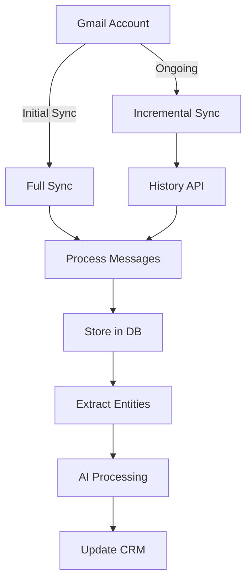

# Email Synchronization

## Table of Contents
1. [Overview](#overview)
2. [Gmail Integration](#gmail-integration)
3. [Email Sync Architecture](#email-sync-architecture)
4. [Real-time Sync](#real-time-sync)
5. [Email Tracking](#email-tracking)
6. [Campaign Management](#campaign-management)
7. [Email AI Features](#email-ai-features)
8. [Deliverability & Spam Prevention](#deliverability--spam-prevention)
9. [Performance & Scaling](#performance--scaling)
10. [Security & Privacy](#security--privacy)
11. [Troubleshooting](#troubleshooting)
12. [Best Practices](#best-practices)

## Overview

The Email Synchronization system provides seamless integration with Gmail and other email providers, enabling real-time sync, intelligent email tracking, campaign management, and AI-powered insights. This system is designed to handle high volumes of email data while maintaining performance and reliability.

### Key Features
- **Real-time Gmail sync** with push notifications
- **Email tracking** (opens, clicks, replies)
- **Campaign management** with A/B testing
- **AI-powered categorization** and insights
- **Smart reply suggestions**
- **Thread grouping** and conversation view
- **Attachment handling** with virus scanning
- **Spam testing** before sending

## Gmail Integration

### OAuth 2.0 Setup
```typescript
// Initialize Gmail OAuth
const oauth2Client = new google.auth.OAuth2(
  process.env.GOOGLE_CLIENT_ID,
  process.env.GOOGLE_CLIENT_SECRET,
  process.env.GOOGLE_REDIRECT_URI
);

// Scopes required for full Gmail access
const GMAIL_SCOPES = [
  'https://www.googleapis.com/auth/gmail.readonly',
  'https://www.googleapis.com/auth/gmail.send',
  'https://www.googleapis.com/auth/gmail.modify',
  'https://www.googleapis.com/auth/gmail.metadata',
  'https://mail.google.com/' // Full access for IMAP
];

// Generate auth URL
const authUrl = oauth2Client.generateAuthUrl({
  access_type: 'offline',
  scope: GMAIL_SCOPES,
  prompt: 'consent'
});
```

### Account Connection Flow
```typescript
mutation ConnectGmailAccount($code: String!) {
  connectGmailAccount(code: $code) {
    id
    email
    displayName
    syncEnabled
    lastSyncAt
    status
  }
}

// After OAuth callback
{
  "code": "4/0AX4XfWh...",
  "workspaceId": "workspace_123"
}
```

### Gmail API Configuration
```typescript
interface GmailConfig {
  // API settings
  batchSize: number; // 100 messages per batch
  maxResults: number; // 500 messages per request
  
  // Sync settings
  historyTypes: HistoryType[];
  labelIds: string[]; // Labels to sync
  includeSpamTrash: boolean;
  
  // Rate limits
  quotaUnit: number; // 250 units per user per second
  dailyQuota: number; // 1,000,000,000 units per day
}

enum HistoryType {
  MESSAGE_ADDED = 'messageAdded',
  MESSAGE_DELETED = 'messageDeleted',
  LABEL_ADDED = 'labelAdded',
  LABEL_REMOVED = 'labelRemoved'
}
```

## Email Sync Architecture

### Sync Strategy


### Database Schema
```typescript
interface EmailAccount {
  id: string;
  workspaceId: string;
  userId: string;
  
  // Account info
  email: string;
  displayName?: string;
  provider: 'gmail' | 'outlook' | 'smtp';
  
  // OAuth tokens
  accessToken: string;
  refreshToken: string;
  tokenExpiresAt: Date;
  
  // Gmail specific
  gmailHistoryId?: string;
  gmailSyncToken?: string;
  
  // Settings
  isPrimary: boolean;
  syncEnabled: boolean;
  signature?: string;
  
  // Status
  lastSyncAt?: Date;
  syncStatus: SyncStatus;
  errorMessage?: string;
}

interface Email {
  id: string;
  workspaceId: string;
  
  // Email identifiers
  messageId: string; // RFC822 Message-ID
  threadId: string;
  inReplyTo?: string;
  references: string[];
  
  // Headers
  subject: string;
  fromEmail: string;
  fromName?: string;
  toEmails: string[];
  ccEmails: string[];
  bccEmails: string[];
  replyTo?: string;
  
  // Content
  bodyHtml?: string;
  bodyText?: string;
  snippet: string;
  
  // Metadata
  folder: EmailFolder;
  labels: string[];
  isRead: boolean;
  isStarred: boolean;
  isImportant: boolean;
  isDraft: boolean;
  isSent: boolean;
  
  // Tracking
  trackingId?: string;
  trackOpens: boolean;
  trackClicks: boolean;
  
  // Relationships
  emailAccountId: string;
  contactId?: string;
  dealId?: string;
  
  // AI analysis
  aiAnalysis?: EmailAIAnalysis;
  sentiment?: Sentiment;
  category?: EmailCategory;
  priority?: Priority;
  
  // Timestamps
  sentAt?: Date;
  receivedAt?: Date;
}
```

### Sync Process
```typescript
class GmailSyncService {
  async performInitialSync(accountId: string) {
    const account = await this.getAccount(accountId);
    const gmail = this.getGmailClient(account);
    
    // Get all message IDs
    let pageToken: string | undefined;
    const messageIds: string[] = [];
    
    do {
      const response = await gmail.users.messages.list({
        userId: 'me',
        maxResults: 500,
        pageToken
      });
      
      messageIds.push(...response.data.messages.map(m => m.id));
      pageToken = response.data.nextPageToken;
    } while (pageToken);
    
    // Batch fetch messages
    await this.batchProcessMessages(gmail, messageIds);
    
    // Store history ID for incremental sync
    const historyId = await this.getLatestHistoryId(gmail);
    await this.updateAccount(accountId, { gmailHistoryId: historyId });
  }
  
  async performIncrementalSync(accountId: string) {
    const account = await this.getAccount(accountId);
    const gmail = this.getGmailClient(account);
    
    // Get history since last sync
    const history = await gmail.users.history.list({
      userId: 'me',
      startHistoryId: account.gmailHistoryId,
      historyTypes: ['messageAdded', 'messageDeleted', 'labelAdded', 'labelRemoved']
    });
    
    // Process history changes
    for (const record of history.data.history || []) {
      await this.processHistoryRecord(record);
    }
    
    // Update history ID
    await this.updateAccount(accountId, {
      gmailHistoryId: history.data.historyId,
      lastSyncAt: new Date()
    });
  }
}
```

### Message Processing
```typescript
async function processEmailMessage(message: gmail_v1.Schema$Message) {
  // Parse headers
  const headers = parseEmailHeaders(message.payload.headers);
  
  // Extract content
  const { html, text } = extractEmailContent(message.payload);
  
  // Process attachments
  const attachments = await processAttachments(message.payload.parts);
  
  // Create email record
  const email: CreateEmailInput = {
    messageId: headers['message-id'],
    threadId: message.threadId,
    subject: headers.subject || '(no subject)',
    fromEmail: parseEmail(headers.from).email,
    fromName: parseEmail(headers.from).name,
    toEmails: parseEmailList(headers.to),
    ccEmails: parseEmailList(headers.cc),
    bccEmails: parseEmailList(headers.bcc),
    bodyHtml: html,
    bodyText: text,
    snippet: message.snippet,
    labels: message.labelIds,
    sentAt: new Date(parseInt(message.internalDate)),
    attachments
  };
  
  // AI processing
  email.aiAnalysis = await analyzeEmail(email);
  
  // Link to contact
  email.contactId = await findOrCreateContact(email.fromEmail);
  
  return email;
}
```

## Real-time Sync

### Gmail Push Notifications
```typescript
// Set up Gmail watch
async function setupGmailWatch(accountId: string) {
  const account = await getAccount(accountId);
  const gmail = getGmailClient(account);
  
  // Create Pub/Sub topic
  const topicName = `gmail-updates-${account.workspaceId}`;
  await pubsub.createTopic(topicName);
  
  // Watch Gmail for changes
  const watchResponse = await gmail.users.watch({
    userId: 'me',
    requestBody: {
      topicName: `projects/${PROJECT_ID}/topics/${topicName}`,
      labelIds: ['INBOX', 'SENT'],
      labelFilterAction: 'include'
    }
  });
  
  // Store watch expiration
  await updateAccount(accountId, {
    watchExpiration: new Date(watchResponse.data.expiration)
  });
  
  // Renew before expiration
  scheduleWatchRenewal(accountId, watchResponse.data.expiration);
}

// Handle push notification
async function handleGmailPushNotification(message: PubSubMessage) {
  const data = JSON.parse(Buffer.from(message.data, 'base64').toString());
  const { emailAddress, historyId } = data;
  
  // Find account
  const account = await findAccountByEmail(emailAddress);
  if (!account) return;
  
  // Queue incremental sync
  await syncQueue.add('gmail-incremental-sync', {
    accountId: account.id,
    historyId
  });
}
```

### WebSocket Updates
```typescript
// Send real-time updates to frontend
class EmailRealtimeService {
  async notifyEmailReceived(email: Email) {
    const channel = `workspace:${email.workspaceId}:emails`;
    
    await this.pubsub.publish(channel, {
      event: 'email.received',
      data: {
        id: email.id,
        subject: email.subject,
        from: {
          email: email.fromEmail,
          name: email.fromName
        },
        preview: email.snippet,
        receivedAt: email.receivedAt
      }
    });
  }
  
  async notifyEmailOpened(trackingEvent: TrackingEvent) {
    const email = await getEmail(trackingEvent.emailId);
    const channel = `workspace:${email.workspaceId}:emails`;
    
    await this.pubsub.publish(channel, {
      event: 'email.opened',
      data: {
        emailId: email.id,
        contactId: email.contactId,
        openedAt: trackingEvent.occurredAt,
        location: trackingEvent.location
      }
    });
  }
}
```

## Email Tracking

### Tracking Pixel Implementation
```typescript
// Generate tracking pixel
function generateTrackingPixel(emailId: string): string {
  const trackingId = generateTrackingId();
  
  // Store tracking info
  await redis.setex(
    `tracking:${trackingId}`,
    7 * 24 * 60 * 60, // 7 days
    JSON.stringify({ emailId, type: 'open' })
  );
  
  return ``;
}

// Handle tracking request
app.get('/track/open/:trackingId.gif', async (req, res) => {
  const { trackingId } = req.params;
  
  // Get tracking info
  const trackingData = await redis.get(`tracking:${trackingId}`);
  if (!trackingData) {
    return res.status(404).send();
  }
  
  const { emailId } = JSON.parse(trackingData);
  
  // Record open event
  await recordTrackingEvent({
    emailId,
    eventType: 'open',
    ipAddress: req.ip,
    userAgent: req.headers['user-agent'],
    occurredAt: new Date()
  });
  
  // Return 1x1 transparent GIF
  const gif = Buffer.from('R0lGODlhAQABAIAAAAAAAP///yH5BAEAAAAALAAAAAABAAEAAAIBRAA7', 'base64');
  res.writeHead(200, {
    'Content-Type': 'image/gif',
    'Content-Length': gif.length,
    'Cache-Control': 'no-store, no-cache, must-revalidate, private'
  });
  res.end(gif);
});
```

### Link Click Tracking
```typescript
// Replace links with tracking URLs
function trackLinks(html: string, emailId: string): string {
  const $ = cheerio.load(html);
  let linkIndex = 0;
  
  $('a').each((i, elem) => {
    const originalUrl = $(elem).attr('href');
    if (!originalUrl || originalUrl.startsWith('mailto:')) return;
    
    const trackingId = generateTrackingId();
    
    // Store link info
    redis.setex(
      `tracking:${trackingId}`,
      7 * 24 * 60 * 60,
      JSON.stringify({
        emailId,
        type: 'click',
        url: originalUrl,
        linkIndex: linkIndex++
      })
    );
    
    // Replace URL
    $(elem).attr('href', `${TRACKING_URL}/track/click/${trackingId}`);
  });
  
  return $.html();
}

// Handle click redirect
app.get('/track/click/:trackingId', async (req, res) => {
  const { trackingId } = req.params;
  
  const trackingData = await redis.get(`tracking:${trackingId}`);
  if (!trackingData) {
    return res.status(404).send('Link not found');
  }
  
  const { emailId, url, linkIndex } = JSON.parse(trackingData);
  
  // Record click event
  await recordTrackingEvent({
    emailId,
    eventType: 'click',
    linkUrl: url,
    linkPosition: linkIndex,
    ipAddress: req.ip,
    userAgent: req.headers['user-agent'],
    occurredAt: new Date()
  });
  
  // Redirect to original URL
  res.redirect(301, url);
});
```

### Tracking Analytics
```typescript
query GetEmailAnalytics($emailId: ID!) {
  emailAnalytics(emailId: $emailId) {
    sent {
      count
      deliveredCount
      bouncedCount
    }
    engagement {
      uniqueOpens
      totalOpens
      openRate
      firstOpenAt
      lastOpenAt
      
      uniqueClicks
      totalClicks
      clickRate
      clickedLinks {
        url
        clicks
        uniqueClicks
      }
    }
    replies {
      count
      firstReplyAt
      replyRate
    }
    devices {
      desktop
      mobile
      tablet
    }
    clients {
      gmail
      outlook
      apple
      other
    }
  }
}
```

## Campaign Management

### Campaign Schema
```typescript
interface EmailCampaign {
  id: string;
  workspaceId: string;
  
  // Campaign info
  name: string;
  subject: string;
  previewText?: string;
  fromName: string;
  fromEmail: string;
  replyTo?: string;
  
  // Content
  bodyHtml: string;
  bodyText: string;
  
  // Recipients
  recipientFilter: RecipientFilter;
  recipientCount: number;
  excludeFilter?: RecipientFilter;
  
  // Settings
  trackOpens: boolean;
  trackClicks: boolean;
  enableUnsubscribe: boolean;
  
  // Scheduling
  scheduledAt?: Date;
  sendingStartedAt?: Date;
  sendingCompletedAt?: Date;
  
  // A/B Testing
  isABTest: boolean;
  variants?: CampaignVariant[];
  winningVariant?: string;
  
  // Status
  status: CampaignStatus;
  sentCount: number;
  
  // Analytics
  analytics: CampaignAnalytics;
}

interface CampaignVariant {
  id: string;
  name: string;
  percentage: number; // Percentage of recipients
  
  // Variable content
  subject?: string;
  fromName?: string;
  bodyHtml?: string;
  
  // Results
  sentCount: number;
  analytics: CampaignAnalytics;
}
```

### Campaign Creation
```typescript
mutation CreateEmailCampaign($input: CreateCampaignInput!) {
  createEmailCampaign(input: $input) {
    id
    name
    recipientCount
    status
    
    # A/B test variants
    variants {
      id
      name
      percentage
      subject
    }
  }
}

// Example: A/B test campaign
{
  "input": {
    "name": "Product Launch Campaign",
    "isABTest": true,
    "variants": [
      {
        "name": "Variant A",
        "percentage": 50,
        "subject": "Introducing Our New Product!"
      },
      {
        "name": "Variant B",
        "percentage": 50,
        "subject": "You're Going to Love This..."
      }
    ],
    "recipientFilter": {
      "tags": ["customer", "engaged"],
      "hasOpenedInLast": 30
    }
  }
}
```

### Email Sending Engine
```typescript
class EmailSendingService {
  async sendCampaign(campaignId: string) {
    const campaign = await getCampaign(campaignId);
    
    // Update status
    await updateCampaign(campaignId, {
      status: 'sending',
      sendingStartedAt: new Date()
    });
    
    // Get recipients
    const recipients = await getRecipients(campaign.recipientFilter);
    
    // Send in batches
    const batches = chunk(recipients, 100);
    
    for (const batch of batches) {
      await this.sendBatch(campaign, batch);
      
      // Rate limiting
      await sleep(1000); // 1 second between batches
    }
    
    // Update completion
    await updateCampaign(campaignId, {
      status: 'sent',
      sendingCompletedAt: new Date()
    });
  }
  
  async sendBatch(campaign: Campaign, recipients: Contact[]) {
    const emails = recipients.map(recipient => ({
      to: recipient.email,
      from: `${campaign.fromName} <${campaign.fromEmail}>`,
      subject: this.personalizeContent(campaign.subject, recipient),
      html: this.prepareEmailHtml(campaign, recipient),
      text: this.personalizeContent(campaign.bodyText, recipient),
      headers: {
        'X-Campaign-ID': campaign.id,
        'List-Unsubscribe': `<${UNSUBSCRIBE_URL}/${recipient.unsubscribeToken}>`
      }
    }));
    
    // Send via provider
    await this.emailProvider.sendBatch(emails);
    
    // Record sent emails
    await this.recordSentEmails(campaign.id, recipients);
  }
  
  personalizeContent(content: string, recipient: Contact): string {
    return content
      .replace(/{{firstName}}/g, recipient.firstName || '')
      .replace(/{{lastName}}/g, recipient.lastName || '')
      .replace(/{{company}}/g, recipient.company || '')
      .replace(/{{email}}/g, recipient.email);
  }
}
```

### Campaign Analytics
```typescript
interface CampaignAnalytics {
  // Delivery
  sent: number;
  delivered: number;
  bounced: number;
  deliveryRate: number;
  
  // Engagement
  uniqueOpens: number;
  totalOpens: number;
  openRate: number;
  
  uniqueClicks: number;
  totalClicks: number;
  clickRate: number;
  clickToOpenRate: number;
  
  // Responses
  replies: number;
  replyRate: number;
  
  unsubscribes: number;
  unsubscribeRate: number;
  
  complaints: number;
  complaintRate: number;
  
  // Revenue (if tracked)
  revenue?: number;
  conversions?: number;
  conversionRate?: number;
}

// Real-time analytics query
subscription CampaignAnalyticsUpdates($campaignId: ID!) {
  campaignAnalytics(campaignId: $campaignId) {
    sent
    openRate
    clickRate
    
    # Real-time engagement map
    engagementByHour {
      hour
      opens
      clicks
    }
    
    # Top performing links
    topLinks {
      url
      clicks
      uniqueClicks
    }
  }
}
```

## Email AI Features

### AI Email Analysis
```typescript
interface EmailAIAnalysis {
  // Classification
  category: EmailCategory;
  priority: Priority;
  
  // Sentiment
  sentiment: Sentiment;
  sentimentScore: number;
  
  // Intent detection
  intents: Intent[];
  primaryIntent: Intent;
  
  // Entity extraction
  entities: {
    people: string[];
    companies: string[];
    dates: Date[];
    amounts: Money[];
    locations: string[];
    phoneNumbers: string[];
    urls: string[];
  };
  
  // Action items
  actionItems: ActionItem[];
  questions: string[];
  
  // Summary
  summary: string;
  keyPoints: string[];
  
  // Response suggestions
  suggestedResponses: ResponseSuggestion[];
}

interface ResponseSuggestion {
  type: 'positive' | 'negative' | 'question' | 'schedule';
  text: string;
  confidence: number;
}
```

### AI Implementation
```typescript
class EmailAIService {
  async analyzeEmail(email: Email): Promise<EmailAIAnalysis> {
    // Prepare prompt
    const prompt = `
      Analyze this email and extract:
      1. Category (sales, support, personal, newsletter, etc.)
      2. Priority (high, medium, low)
      3. Sentiment (positive, neutral, negative)
      4. Intent (inquiry, complaint, request, information, etc.)
      5. Action items
      6. Key entities (people, companies, dates, amounts)
      7. Summary in 1-2 sentences
      
      Email:
      From: ${email.fromEmail}
      Subject: ${email.subject}
      Body: ${email.bodyText}
    `;
    
    // Call AI service
    const response = await claude.complete({
      prompt,
      model: 'claude-3-opus',
      maxTokens: 1000
    });
    
    // Parse structured response
    return this.parseAIResponse(response);
  }
  
  async generateSmartReplies(email: Email, context: Context): Promise<string[]> {
    const prompt = `
      Generate 3 appropriate reply options for this email.
      Consider the context and maintain professional tone.
      
      Context:
      - Sender: ${email.fromName} (${context.relationship})
      - Previous interactions: ${context.interactionCount}
      - Current deals: ${context.activeDeals}
      
      Email: ${email.bodyText}
      
      Generate replies for:
      1. Positive response
      2. Need more information
      3. Polite decline/delay
    `;
    
    const response = await gpt4.complete({ prompt });
    return this.parseReplySuggestions(response);
  }
}
```

### Email Template AI
```typescript
mutation GenerateEmailTemplate($input: GenerateTemplateInput!) {
  generateEmailTemplate(input: $input) {
    subject
    bodyHtml
    bodyText
    variations {
      formal
      casual
      enthusiastic
    }
  }
}

// Example input
{
  "input": {
    "purpose": "follow_up",
    "context": {
      "recipientName": "John",
      "companyName": "Acme Corp",
      "lastInteraction": "Demo call on Monday",
      "nextStep": "Proposal review"
    },
    "tone": "professional",
    "length": "medium"
  }
}
```

## Deliverability & Spam Prevention

### Pre-send Spam Testing
```typescript
interface SpamTestResult {
  score: number; // 0-10 scale
  pass: boolean; // score < 3
  
  // Issues found
  issues: SpamIssue[];
  
  // Content analysis
  content: {
    spamWords: string[];
    capsPercentage: number;
    linkRatio: number;
    imageToTextRatio: number;
    missingUnsubscribe: boolean;
  };
  
  // Technical checks
  technical: {
    spf: boolean;
    dkim: boolean;
    dmarc: boolean;
    reverseIp: boolean;
    blacklisted: boolean;
  };
  
  // Recommendations
  recommendations: string[];
}

async function testEmailSpamScore(email: Email): Promise<SpamTestResult> {
  const tests = [
    checkSpamWords(email),
    checkCapsUsage(email),
    checkLinkRatio(email),
    checkAuthentication(email),
    checkBlacklists(email),
    checkHTMLStructure(email)
  ];
  
  const results = await Promise.all(tests);
  
  // Calculate total score
  const score = results.reduce((sum, result) => sum + result.score, 0);
  
  return {
    score,
    pass: score < 3,
    issues: results.flatMap(r => r.issues),
    recommendations: generateRecommendations(results)
  };
}
```

### Email Authentication
```typescript
// SPF Record
async function verifySPF(domain: string, ip: string): Promise<boolean> {
  const spfRecord = await dns.resolveTxt(domain);
  const spf = spfRecord.find(r => r.startsWith('v=spf1'));
  
  if (!spf) return false;
  
  // Parse and validate SPF
  return validateSPFRecord(spf, ip);
}

// DKIM Signing
function signEmailWithDKIM(email: Email): Email {
  const privateKey = process.env.DKIM_PRIVATE_KEY;
  const selector = process.env.DKIM_SELECTOR;
  
  const signature = crypto.createSign('RSA-SHA256')
    .update(canonicalizeEmail(email))
    .sign(privateKey, 'base64');
  
  email.headers['DKIM-Signature'] = `
    v=1; a=rsa-sha256; c=relaxed/relaxed;
    d=${SENDING_DOMAIN}; s=${selector};
    h=from:to:subject:date;
    bh=${bodyHash};
    b=${signature}
  `;
  
  return email;
}

// DMARC Alignment
async function checkDMARCAlignment(email: Email): Promise<boolean> {
  const dmarcRecord = await getDMARCRecord(email.fromDomain);
  
  if (!dmarcRecord) return true; // No DMARC = pass
  
  const spfAligned = await checkSPFAlignment(email);
  const dkimAligned = await checkDKIMAlignment(email);
  
  // Check alignment based on DMARC policy
  if (dmarcRecord.policy === 'strict') {
    return spfAligned && dkimAligned;
  } else {
    return spfAligned || dkimAligned;
  }
}
```

### Bounce Handling
```typescript
interface BounceEvent {
  emailId: string;
  bounceType: 'hard' | 'soft' | 'blocked';
  bounceSubtype: string;
  bouncedAt: Date;
  diagnosticCode?: string;
  action: 'failed' | 'delayed' | 'delivered';
}

class BounceHandler {
  async handleBounce(event: BounceEvent) {
    const email = await getEmail(event.emailId);
    
    // Update email status
    await updateEmail(event.emailId, {
      bounced: true,
      bounceType: event.bounceType,
      bouncedAt: event.bouncedAt
    });
    
    // Handle based on bounce type
    switch (event.bounceType) {
      case 'hard':
        // Permanent failure - mark contact as invalid
        await markEmailInvalid(email.toEmails[0]);
        await suppressEmailAddress(email.toEmails[0]);
        break;
        
      case 'soft':
        // Temporary failure - retry logic
        if (await shouldRetry(email)) {
          await queueEmailRetry(email);
        }
        break;
        
      case 'blocked':
        // Reputation issue - investigate
        await notifyAdminOfBlock(email, event.diagnosticCode);
        break;
    }
  }
}
```

## Performance & Scaling

### Email Processing Queue
```typescript
// BullMQ configuration
const emailQueues = {
  sync: new Queue('email-sync', {
    defaultJobOptions: {
      attempts: 3,
      backoff: {
        type: 'exponential',
        delay: 2000
      }
    }
  }),
  
  send: new Queue('email-send', {
    defaultJobOptions: {
      attempts: 5,
      backoff: {
        type: 'exponential',
        delay: 5000
      }
    }
  }),
  
  analyze: new Queue('email-analyze', {
    defaultJobOptions: {
      attempts: 2,
      removeOnComplete: true
    }
  })
};

// Worker configuration
const syncWorker = new Worker('email-sync', async (job) => {
  const { accountId, type } = job.data;
  
  switch (type) {
    case 'initial':
      await performInitialSync(accountId);
      break;
    case 'incremental':
      await performIncrementalSync(accountId);
      break;
    case 'webhook':
      await processWebhookSync(accountId, job.data.historyId);
      break;
  }
}, {
  concurrency: 5,
  limiter: {
    max: 100,
    duration: 60000 // 100 jobs per minute
  }
});
```

### Caching Strategy
```typescript
// Email caching
const emailCache = {
  // Cache email content
  async setEmail(email: Email) {
    const key = `email:${email.id}`;
    const ttl = email.folder === 'sent' ? 3600 : 300; // 1hr for sent, 5min for others
    
    await redis.setex(key, ttl, JSON.stringify(email));
  },
  
  // Cache thread
  async setThread(threadId: string, emails: Email[]) {
    const key = `thread:${threadId}`;
    const ttl = 600; // 10 minutes
    
    await redis.setex(key, ttl, JSON.stringify(emails));
  },
  
  // Cache search results
  async setSearchResults(query: string, results: SearchResults) {
    const key = `search:${createHash(query)}`;
    const ttl = 300; // 5 minutes
    
    await redis.setex(key, ttl, JSON.stringify(results));
  }
};
```

### Database Optimization
```sql
-- Indexes for email queries
CREATE INDEX idx_emails_thread ON emails(workspace_id, thread_id);
CREATE INDEX idx_emails_received ON emails(workspace_id, received_at DESC);
CREATE INDEX idx_emails_contact ON emails(workspace_id, contact_id);
CREATE INDEX idx_emails_folder ON emails(workspace_id, folder);

-- Full-text search
CREATE INDEX idx_emails_search ON emails USING gin(
  to_tsvector('english', 
    coalesce(subject, '') || ' ' || 
    coalesce(body_text, '')
  )
);

-- Partitioning for scale
CREATE TABLE emails_2024_01 PARTITION OF emails
  FOR VALUES FROM ('2024-01-01') TO ('2024-02-01');
```

## Security & Privacy

### Email Encryption
```typescript
// Encrypt sensitive email content
class EmailEncryption {
  private cipher = crypto.createCipher('aes-256-gcm', process.env.ENCRYPTION_KEY);
  
  encryptEmail(email: Email): EncryptedEmail {
    // Encrypt body
    const encryptedBody = this.encrypt(email.bodyHtml);
    
    // Encrypt attachments
    const encryptedAttachments = email.attachments.map(att => ({
      ...att,
      content: this.encrypt(att.content)
    }));
    
    return {
      ...email,
      bodyHtml: encryptedBody.ciphertext,
      bodyHtmlIv: encryptedBody.iv,
      attachments: encryptedAttachments
    };
  }
  
  private encrypt(data: string): EncryptedData {
    const iv = crypto.randomBytes(16);
    const cipher = crypto.createCipheriv('aes-256-gcm', this.key, iv);
    
    let ciphertext = cipher.update(data, 'utf8', 'hex');
    ciphertext += cipher.final('hex');
    
    return {
      ciphertext,
      iv: iv.toString('hex'),
      tag: cipher.getAuthTag().toString('hex')
    };
  }
}
```

### Access Control
```typescript
// Email access policies
const emailAccessPolicies = {
  // Can read email
  canRead: async (userId: string, emailId: string): Promise<boolean> => {
    const email = await getEmail(emailId);
    const user = await getUser(userId);
    
    // Check workspace membership
    if (user.workspaceId !== email.workspaceId) {
      return false;
    }
    
    // Check email ownership
    const emailAccount = await getEmailAccount(email.emailAccountId);
    if (emailAccount.userId !== userId && !user.isAdmin) {
      return false;
    }
    
    return true;
  },
  
  // Can send email
  canSend: async (userId: string, accountId: string): Promise<boolean> => {
    const account = await getEmailAccount(accountId);
    
    // Only account owner or admins can send
    return account.userId === userId || await isAdmin(userId);
  }
};
```

### Audit Logging
```typescript
// Log all email actions
async function logEmailAction(action: EmailAction) {
  await auditLog.create({
    action: action.type,
    userId: action.userId,
    resourceType: 'email',
    resourceId: action.emailId,
    metadata: {
      ip: action.ip,
      userAgent: action.userAgent,
      ...action.metadata
    },
    timestamp: new Date()
  });
}

// Email action types
enum EmailActionType {
  READ = 'email.read',
  SEND = 'email.send',
  DELETE = 'email.delete',
  FORWARD = 'email.forward',
  ARCHIVE = 'email.archive',
  MARK_SPAM = 'email.mark_spam'
}
```

## Troubleshooting

### Common Issues

#### Gmail Sync Not Working
```typescript
// Diagnostic function
async function diagnoseGmailSync(accountId: string) {
  const diagnostics = {
    account: await checkAccountStatus(accountId),
    tokens: await checkTokenValidity(accountId),
    permissions: await checkGmailPermissions(accountId),
    quotaUsage: await checkQuotaUsage(accountId),
    lastSync: await getLastSyncInfo(accountId),
    errors: await getRecentErrors(accountId)
  };
  
  return {
    healthy: Object.values(diagnostics).every(d => d.status === 'ok'),
    diagnostics,
    recommendations: generateRecommendations(diagnostics)
  };
}
```

#### Email Tracking Not Working
1. Check tracking domain configuration
2. Verify SSL certificates
3. Test pixel/link generation
4. Check Redis connectivity
5. Verify CORS settings

#### High Bounce Rates
1. Verify SPF/DKIM/DMARC setup
2. Check IP reputation
3. Review email content for spam triggers
4. Verify recipient list quality
5. Check sending volume patterns

### Performance Issues

#### Slow Email Sync
```typescript
// Performance monitoring
const syncMetrics = {
  recordSyncTime: async (accountId: string, duration: number, messageCount: number) => {
    await prometheus.histogram('gmail_sync_duration', duration, {
      account: accountId
    });
    
    await prometheus.gauge('gmail_sync_rate', messageCount / duration, {
      account: accountId
    });
  },
  
  checkSyncHealth: async (accountId: string) => {
    const metrics = await getSyncMetrics(accountId);
    
    if (metrics.avgSyncTime > 60000) { // 1 minute
      console.warn(`Slow sync detected for account ${accountId}`);
      await optimizeSyncStrategy(accountId);
    }
  }
};
```

## Best Practices

### Email Sync Best Practices
1. **Batch Operations**: Process emails in batches of 100
2. **Incremental Sync**: Use Gmail History API for updates
3. **Error Handling**: Implement exponential backoff
4. **Rate Limiting**: Respect Gmail API quotas
5. **Monitoring**: Track sync performance metrics

### Campaign Best Practices
1. **Warm-up IPs**: Gradually increase sending volume
2. **List Hygiene**: Regular cleanup of invalid emails
3. **Engagement Tracking**: Remove unengaged subscribers
4. **Content Quality**: A/B test subject lines and content
5. **Timing**: Send at optimal times for audience

### Security Best Practices
1. **Token Management**: Refresh tokens before expiry
2. **Encryption**: Encrypt sensitive email content
3. **Access Control**: Implement proper permissions
4. **Audit Trail**: Log all email operations
5. **Compliance**: Follow GDPR/CCPA for email data

### Performance Best Practices
```typescript
// Optimize email queries
const optimizedQueries = {
  // Use projection to limit data
  getEmailList: async (filter: EmailFilter) => {
    return prisma.email.findMany({
      where: filter,
      select: {
        id: true,
        subject: true,
        fromEmail: true,
        snippet: true,
        receivedAt: true,
        isRead: true,
        isStarred: true
      }
    });
  },
  
  // Use aggregation pipeline
  getEmailStats: async (workspaceId: string) => {
    return prisma.$queryRaw`
      SELECT 
        DATE_TRUNC('day', received_at) as date,
        COUNT(*) as count,
        COUNT(*) FILTER (WHERE is_read) as read_count,
        COUNT(*) FILTER (WHERE tracking_opens > 0) as opened_count
      FROM emails
      WHERE workspace_id = ${workspaceId}
        AND received_at > NOW() - INTERVAL '30 days'
      GROUP BY date
      ORDER BY date DESC
    `;
  }
};
```

## Related Documentation

- [Gmail API Reference](https://developers.google.com/gmail/api)
- [Email Authentication Guide](../guides/email-authentication.md)
- [Spam Prevention](./spam-prevention.md)
- [Campaign Templates](../guides/campaign-templates.md)
- [Email Analytics](../guides/email-analytics.md)

---

*Platform Version: 1.0.0*  
*Last Updated: 2024-01-15*